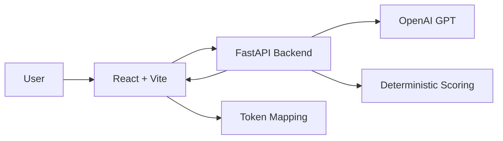

<div align="center">

# Echo
### Prompt Risk Intelligence & Human‑Centered Refinement

<strong>Prevent hallucinations at the source: enforce clarity, structure intent, and iterate with transparency.</strong>

</div>

---

## 1. Why Echo Exists
LLM hallucinations are frequently *prompt-borne*: ambiguity, missing constraints, vague referents, underspecified outputs. Most tooling reacts **after** generation. Echo shifts left: it analyzes a prompt *before* use, exposing structural risk so the author can refine proactively.

> Clarity is a controllable input surface. Echo makes it measurable.

---

## 2. What Makes It Different
| Dimension | Conventional Approaches | Echo Approach |
|-----------|------------------------|---------------|
| Timing | Post-output critique | Pre‑generation risk surfacing |
| Explanation | Heuristics or opaque LLM notes | Structured, criterion‑scoped XML + spans |
| Consistency | Stochastic judgments | Hybrid LLM extraction + deterministic normalization |
| User Agency | One-shot prompts | Iterative refinement loop with targeted deltas |
| Traceability | Global score only | Token‑linked `<RISK_n>` markers ↔ rendered highlights |
| Evolvability | Hard-coded rules | Pluggable criteria & scoring weights |

---

## 3. Conceptual Model
```
Prompt Text → (Sanitize) → (LLM Structural Extraction) → (XML + <RISK_n> Tags)
					→ (Deterministic Scoring Layer) → (Risk Artifacts) → (Human Interpretation)
					→ (Refinement Chat & Revision Loop) → Improved Prompt
```

Artifacts (primary contract):
1. Annotated prompt with stable tags.
2. Array of risk token objects.
3. Criteria-level assessment + overall score.
4. Narrative summary for scanning.

---

## 4. Core Workflow (Loop)
1. Author or paste prompt
2. Run analysis (`/api/analyze`)
3. Inspect highlights + criteria
4. Ask assistant for targeted improvement
5. Revise prompt
6. Re‑analyze until acceptable risk

---

## 5. Feature Matrix (Condensed)
| Area | Capability | Notes |
|------|-----------|-------|
| Analysis | Span extraction (`<RISK_n>`) | Stable IDs for UI binding |
| Scoring | Deterministic normalization | Transparent weighting layer |
| UX | Color risk highlighting | Red=high, Yellow=medium |
| Guidance | Refinement assistant | Context aware suggestions |
| Resilience | Partial output handling | Degraded XML fallback |
| Extensibility | Criteria plug‑in model (planned) | Domain packs roadmap |
| Dev Experience | Typed contracts (Pydantic ↔ TS) | Schema alignment |

---

## 6. Architecture Snapshot
Refer to `docs/architecture.md` for deep detail.



---

## 7. Scoring & Semantics
Each criterion emits a categorical risk (low/medium/high) + percentage. An overall score is derived using weighted aggregation (default equal weighting):

\( overall = round( \frac{\sum_i w_i * p_i}{\sum_i w_i} ) \)

Where \(p_i\) = criterion percentage (0–100), \(w_i\) = weight (default 1.0). High risk tokens typically correspond to criteria with >60% normalized ambiguity/deficit concentration.

Deterministic layer responsibilities:
* Clamp malformed values
* Enforce integer percentage domain
* Provide fallback overall score if XML partial

---

## 8. API Overview
| Method | Endpoint | Purpose | Returns |
|--------|----------|---------|---------|
| POST | `/api/analyze` | Analyze a prompt | Risk artifacts bundle |
| POST | `/api/refine` | Non‑stream refinement suggestion | Assistant text response |
| GET | `/api/health/ping` | Liveness check | `{status:"ok"}` |

Example analyze request:
```json
POST /api/analyze
{
	"prompt": "Explain quantum computing like I'm a lawyer with examples."
}
```
Response (abridged):
```json
{
	"annotated_prompt": "Explain <RISK_1>quantum computing</RISK_1> like I'm a <RISK_2>lawyer</RISK_2>...",
	"risk_tokens": [
		{"id":"RISK_1","text":"quantum computing","risk_level":"medium","classification":["complex-domain"]},
		{"id":"RISK_2","text":"lawyer","risk_level":"high","classification":["audience-ambiguity"]}
	],
	"risk_assessment": {
		"overall_percentage": 58,
		"criteria": [
			{"name":"Ambiguity-Vagueness","risk":"high","percentage":70},
			{"name":"Audience-Specification","risk":"medium","percentage":55}
		]
	},
	"analysis_summary": "Prompt mixes domain complexity with unclear audience framing..."
}
```

---

## 9. Data Contract (Abbreviated Types)
```ts
type RiskToken = {
	id: string;          // RISK_#
	text: string;
	risk_level: 'low' | 'medium' | 'high';
	classification: string[]; // heuristic labels
};

type Criterion = {
	name: string;
	risk: 'low' | 'medium' | 'high';
	percentage: number; // 0-100
	description?: string;
};

interface AnalysisResponse {
	annotated_prompt: string;
	risk_tokens: RiskToken[];
	risk_assessment: { overall_percentage: number; criteria: Criterion[] };
	analysis_summary: string;
}
```

---

## 10. Quick Start
Prereqs: Python 3.13+, Node 18+, OpenAI key.

```bash
git clone https://github.com/<your-org>/echo-hallucination-detect.git
cd echo-hallucination-detect
cp .env.example .env   # add your OPENAI_API_KEY
python -m venv .venv
./.venv/Scripts/activate  # Windows PowerShell
pip install -r server/requirements.txt
python start_server.py

cd client
npm install
npm run dev
```
Open: http://localhost:5173

---

## 11. Evaluation & Credibility
Deterministic post‑processing ensures stable scores across identical inputs. Future evaluation directions:
* Prompt corpus regression tracking
* Inter‑rater alignment study (human vs. system risk labels)
* Drift detection across LLM provider changes

---

## 12. Research Context & Citation
Developed as part of a Bachelor’s Thesis at the Technical University of Munich (TUM) on proactive hallucination mitigation through prompt-surface analysis.

If you cite this work:
```text
Nejjar, M. (2025). Echo: A Hybrid LLM + Deterministic System for Prompt Risk Intelligence and Refinement. Bachelor’s Thesis, Technical University of Munich.
```

---

## 13. Roadmap (Excerpt)
| Theme | Planned Direction |
|-------|-------------------|
| Explainability | Per‑token rationale chains |
| Ensembles | Cross‑model disagreement surfacing |
| Batch Analysis | Multi‑prompt comparison dashboard |
| Persistence | Historical trend & delta graphs |
| Domain Packs | Legal / Medical / Finance criteria modules |
| Export | Markdown + PDF reporting bundle |

---

## 14. Contributing
1. Open an issue describing enhancement or bug.
2. Fork & create feature branch.
3. Provide focused PR (tests if logic change).
4. Keep docs & types in sync.

Low‑bar contributions: improved criterion definitions, additional prompt examples, evaluation scripts.

---

## 15. FAQ
**Q: Why not just rely on the LLM to self‑critique?**  
Because self‑critique inherits the same ambiguity surface; hybrid deterministic overlays add stability.

**Q: Does this prevent all hallucinations?**  
No—reduces *prompt‑induced* risk factors; model internals remain stochastic.

**Q: Can I swap the LLM provider?**  
Yes—`services/llm.py` isolates the call; implement alternate adapter.

**Q: Are scores comparable across domains?**  
Within consistent criteria configuration, yes. Domain packs would version criteria.

**Q: Why XML instead of JSON?**  
XML tagging discourages model from collapsing structure and pairs well with embedded span tags.

**Q: Is streaming supported?**  
Refinement streaming route scaffold exists; activation is roadmap item.

---

## 16. Diagram Sources
Authoritative Mermaid sources: `docs/diagrams/`. See that directory README for generation commands.

---

## 17. License & Contact
MIT License (see `LICENSE`).  
Contact: mohamed.nejjar@tum.de

---

> Built with curiosity. Refined through iteration. Aimed at clarity.


