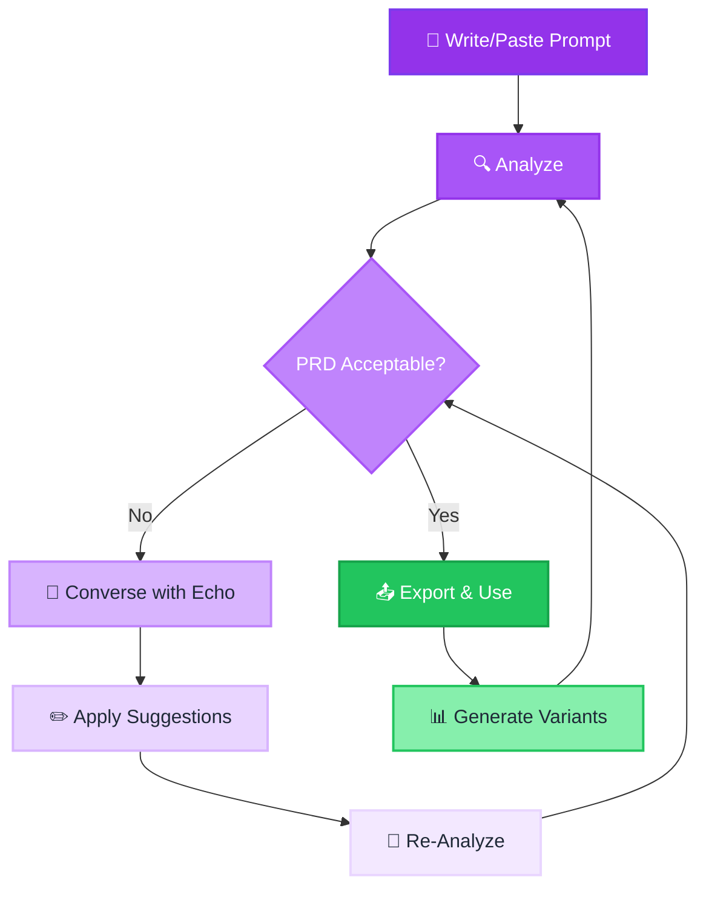
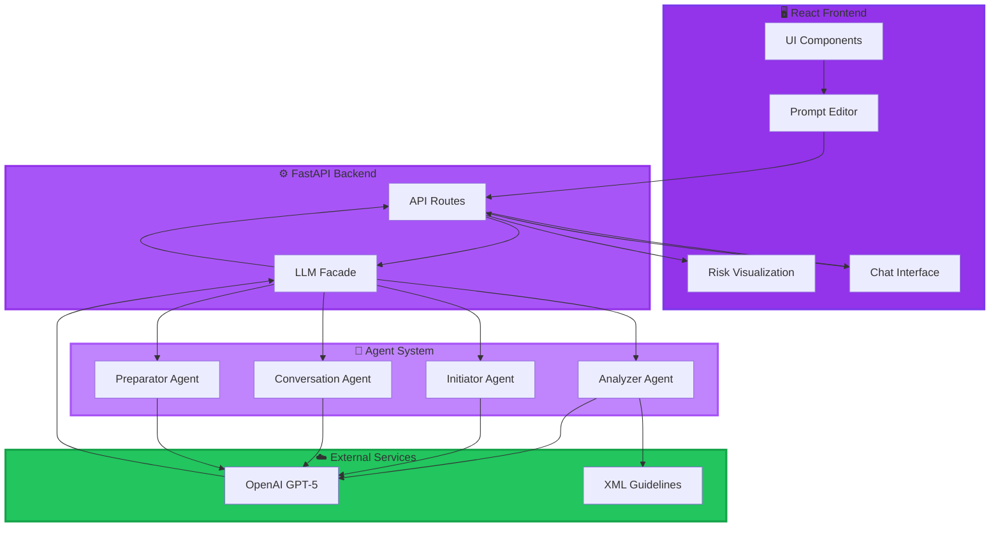

<div align="center">


# Echo

### Mitigating Hallucination Potential in User Prompts Through AI-Guided Iterative Refinement

<strong>A novel shift-left approach to LLM hallucination mitigation — tackling the problem at its source: the user prompt.</strong>

[](LICENSE)
[](https://www.python.org/downloads/)
[](https://www.typescriptlang.org/)
[](https://fastapi.tiangolo.com/)
[](https://reactjs.org/)
[](https://www.tum.de/)

[📖 Research](#-research-overview) • [🧬 Taxonomy](#-novel-hallucination-taxonomy) • [🔬 PRD Formula](#-prompt-risk-density-prd) • [🤖 Pipeline](#-multi-agent-pipeline) • [🚀 Quick Start](#-quick-start) • [📚 Docs](#-documentation)

</div>

---

## 📖 Research Overview

> **Bachelor's Thesis**: *"Mitigating Hallucination Potential in User Prompts Through AI-Guided Iterative Refinement"*  
> **Author**: Mohamed Nejjar  
> **Institution**: Technical University of Munich (TUM)  
> **Year**: 2025

### The Problem Space

Current hallucination research overwhelmingly focuses on **LLM-sided factors**: training data quality, model architecture, decoding strategies, and retrieval augmentation. However, this ignores a critical truth:

> **Every LLM output has two actors — the model AND the user.**

The user's prompt is a controllable input surface that significantly influences hallucination risk. Yet, this dimension remains vastly under-researched.

### The Motivation

```
┌─────────────────────────────────────────────────────────────────────────────┐
│                                                                             │
│   Traditional Approach:        Echo's Shift-Left Approach:                  │
│                                                                             │
│   User Prompt → LLM → Output → Detect Hallucination → Fix                   │
│                        ↑                                                    │
│                   [Too Late]                                                │
│                                                                             │
│   vs.                                                                       │
│                                                                             │
│   User Prompt → [ANALYZE & REFINE] → Improved Prompt → LLM → Output         │
│                        ↑                                                    │
│                   [Prevention]                                              │
│                                                                             │
└─────────────────────────────────────────────────────────────────────────────┘
```

Echo implements a **shift-left methodology** — tackling hallucinations *before* they occur by analyzing and refining the user's prompt. This eliminates one entire problem source from the equation.

### Key Insights

| Insight | Implication |
|---------|-------------|
| **Market leaders are improving** | Closed-source models (GPT-5, Claude) are becoming robust against *factuality* hallucinations through better training and refusal mechanisms |
| **Faithfulness remains tricky** | *Faithfulness* hallucinations (contradicting user-provided context) are NOT solved by model improvements — they stem from how users formulate prompts |
| **Accessibility gap** | Smaller, open-source models produce more hallucinations. Better prompts can bridge this gap, making robust AI more accessible without relying on expensive closed-source APIs |
| **User-sided factors are controllable** | Unlike model architecture or training data, prompt quality is something users can directly improve |

---

## 🧬 Novel Hallucination Taxonomy

Echo introduces a **structured classification system** for hallucination triggers that distinguishes between the two actors in any LLM interaction.

### Taxonomy Tree

```
                              ┌─────────────────┐
                              │  Hallucinations │
                              └────────┬────────┘
                                       │
                 ┌─────────────────────┴─────────────────────┐
                 │                                           │
        ┌────────┴────────┐                        ┌─────────┴─────────┐
        │   User-Sided    │                        │    LLM-Sided      │
        │    (Novel)      │                        │   (Established)   │
        └────────┬────────┘                        └─────────┬─────────┘
                 │                                           │
       ┌─────────┴─────────┐                      ┌──────────┴──────────┐
       │                   │                      │                     │
┌──────┴──────┐    ┌───────┴──────┐        ┌─────┴─────┐    ┌──────────┴──────────┐
│ Prompt Risk │    │  Meta Risk   │        │ Training  │    │ Data / Architecture │
│   (Novel)   │    │   (Novel)    │        └───────────┘    └─────────────────────┘
└─────────────┘    └──────────────┘

                            ↓
              ┌─────────────┴─────────────┐
              │   Both can manifest as:   │
              ├───────────────────────────┤
              │ • Faithfulness Errors     │ ← Contradicts user-provided context
              │ • Factuality Errors       │ ← Contradicts world knowledge
              └───────────────────────────┘
```

### Taxonomy Levels

| Level | Classification | Description | Novel? |
|-------|---------------|-------------|--------|
| **L1** | User-Sided vs. LLM-Sided | The two actors that contribute to hallucinations | ✅ Novel |
| **L2** | Prompt Risk vs. Meta Risk | Subdivision of user-sided errors | ✅ Novel |
| **L3** | Faithfulness vs. Factuality | How the hallucination manifests | Established |

### User-Sided Risk Categories

<table>
<thead>
<tr>
<th width="20%">Category</th>
<th width="40%">Description</th>
<th width="40%">Examples</th>
</tr>
</thead>
<tbody>
<tr>
<td><strong>🔤 Prompt Risk</strong></td>
<td>Risks related to <em>how</em> the user writes the actual prompt — word choice, phrasing, ambiguity, vagueness</td>
<td>
• Ambiguous pronouns ("it", "they")<br>
• Vague quantifiers ("some", "many")<br>
• Unclear temporal references<br>
• Missing constraints
</td>
</tr>
<tr>
<td><strong>📋 Meta Risk</strong></td>
<td>Risks related to <em>extra-prompt context</em> — structural issues that cannot be fixed by rewording individual tokens</td>
<td>
• Missing actors/stakeholders<br>
• Conflicting instructions<br>
• Incomplete context<br>
• Undefined output format
</td>
</tr>
</tbody>
</table>

### Detection Characteristics

| Aspect | Prompt Risk | Meta Risk |
|--------|-------------|-----------|
| **Granularity** | Token-level | Structural |
| **Highlighting** | 1:1 token-to-risk mapping possible | Cannot be directly highlighted |
| **Detection** | Span-based annotation | Holistic analysis required |
| **Remediation** | Rephrase specific tokens | Add/restructure entire sections |

---

## 🔬 Prompt Risk Density (PRD)

Echo introduces **Prompt Risk Density (PRD)** — a novel metric inspired by percentage risk analysis methodologies used across scientific and industrial domains.

### The Formula

$$
\text{PRD} = \frac{\sum_{i=1}^{n} \left( \text{span}_i \times w_i \right)}{L}
$$

Where:
- $n$ = Number of identified risk tokens
- $\text{span}_i$ = Character length of risk token $i$
- $w_i$ = Severity weight of risk token $i$
  - Medium risk: $w = 1$
  - High risk: $w = 2$
  - Critical risk: $w = 3$
- $L$ = Total prompt length (in characters)

### Interpretation

| PRD Range | Risk Level | Interpretation |
|-----------|------------|----------------|
| $0.00 - 0.05$ | 🟢 Low | Well-structured prompt with minimal ambiguity |
| $0.05 - 0.15$ | 🟡 Moderate | Some refinement recommended |
| $0.15 - 0.30$ | 🟠 High | Significant hallucination potential |
| $> 0.30$ | 🔴 Critical | Prompt requires substantial revision |

### Dual PRD Assessment

Echo calculates **two separate PRD values**:

1. **Prompt PRD** — Risk density from token-level issues (ambiguous words, vague references)
2. **Meta PRD** — Risk density from structural issues (missing context, conflicting instructions)

```
┌────────────────────────────────────────────────────────────────┐
│                    PRD Assessment Gauge                        │
├────────────────────────────────────────────────────────────────┤
│                                                                │
│  Prompt PRD:  ████████░░░░░░░░░░░░  0.12 (Moderate)           │
│                                                                │
│  Meta PRD:    ████████████░░░░░░░░  0.18 (High)               │
│                                                                │
│  Combined:    ████████████░░░░░░░░  0.15 (Moderate-High)      │
│                                                                │
└────────────────────────────────────────────────────────────────┘
```

---

## 🤖 Multi-Agent Pipeline

Echo implements a **multi-step, semi-human-assisted workflow** through a coordinated multi-agent system.

### Pipeline Architecture

```
┌─────────────────────────────────────────────────────────────────────────────────────┐
│                                 ECHO PIPELINE                                        │
└─────────────────────────────────────────────────────────────────────────────────────┘

┌─────────────┐     ┌─────────────┐     ┌─────────────┐     ┌─────────────┐
│   ANALYZER  │────▶│  INITIATOR  │────▶│CONVERSATION │────▶│ PREPARATOR  │
│    AGENT    │     │    AGENT    │     │    AGENT    │     │    AGENT    │
└─────────────┘     └─────────────┘     └─────────────┘     └─────────────┘
       │                   │                   │                   │
       ▼                   ▼                   ▼                   ▼
┌─────────────┐     ┌─────────────┐     ┌─────────────┐     ┌─────────────┐
│ Risk tokens │     │  Targeted   │     │  Iterative  │     │  Polished   │
│ PRD scores  │     │  questions  │     │ refinement  │     │  variants   │
│ Highlights  │     │  to user    │     │  dialogue   │     │  for reuse  │
└─────────────┘     └─────────────┘     └─────────────┘     └─────────────┘
```

### Agent Responsibilities

<table>
<thead>
<tr>
<th width="15%">Agent</th>
<th width="25%">Role</th>
<th width="30%">Input</th>
<th width="30%">Output</th>
</tr>
</thead>
<tbody>
<tr>
<td><strong>🔍 Analyzer</strong></td>
<td>The Highlighter — scans prompts for hallucination-inducing tokens and structural aspects</td>
<td>Raw user prompt + Analysis mode (Faithfulness/Factuality/Both)</td>
<td>
• Annotated prompt with risk markers<br>
• Token-level highlights (🟡 Medium, 🟠 High, 🔴 Critical)<br>
• Prompt PRD + Meta PRD scores<br>
• Detailed violation mappings with taxonomy references
</td>
</tr>
<tr>
<td><strong>💡 Initiator</strong></td>
<td>The Guide — generates targeted questions to start the refinement process</td>
<td>Analysis results + Violated guidelines</td>
<td>One precise question per broken guideline to guide user toward mitigation</td>
</tr>
<tr>
<td><strong>💬 Conversation</strong></td>
<td>The Refinement Partner — iteratively improves the prompt through dialogue</td>
<td>Original prompt + Analysis context + Chat history</td>
<td>Critical, guideline-adherent suggestions (NOT a "yes-man")</td>
</tr>
<tr>
<td><strong>📝 Preparator</strong></td>
<td>The Polisher — generates alternative prompt versions based on the conversation</td>
<td>Refined prompt + Conversation history + Original analysis</td>
<td>Multiple polished prompt variants ready for use</td>
</tr>
</tbody>
</table>

### Analysis Output Components

The Analyzer Agent produces a comprehensive risk assessment:

```
┌─────────────────────────────────────────────────────────────────────────────────┐
│                           ANALYSIS OUTPUT                                        │
├─────────────────────────────────────────────────────────────────────────────────┤
│                                                                                  │
│  1. ANNOTATED PROMPT                                                            │
│     ┌──────────────────────────────────────────────────────────────────────┐   │
│     │ Write a blog post about [RISK_1: quantum computing] for              │   │
│     │ [RISK_2: general audience] that explains [RISK_3: how it works]      │   │
│     └──────────────────────────────────────────────────────────────────────┘   │
│                                                                                  │
│  2. RISK HIGHLIGHTS                                                             │
│     🟡 RISK_1: "quantum computing" — Complex domain, no depth specified         │
│     🟠 RISK_2: "general audience" — Vague audience definition                   │
│     🔴 RISK_3: "how it works" — Ambiguous scope                                 │
│                                                                                  │
│  3. PRD GAUGE                                                                   │
│     Prompt PRD: 0.14  │  Meta PRD: 0.08  │  Combined: 0.11                      │
│                                                                                  │
│  4. VIOLATION MAPPING                                                           │
│     ┌────────────────┬─────────────────┬────────────────────────────────────┐  │
│     │ Token          │ Guideline       │ Mitigation                         │  │
│     ├────────────────┼─────────────────┼────────────────────────────────────┤  │
│     │ RISK_1         │ F-1.2           │ Specify technical depth expected   │  │
│     │ RISK_2         │ M-2.1           │ Define audience knowledge level    │  │
│     │ RISK_3         │ F-3.4           │ Enumerate specific aspects         │  │
│     └────────────────┴─────────────────┴────────────────────────────────────┘  │
│                                                                                  │
└─────────────────────────────────────────────────────────────────────────────────┘
```

### Guideline System

Echo's analysis is grounded in structured XML-based guidelines:

| File | Purpose | Risk Type |
|------|---------|-----------|
| `faithfulness.xml` | Rules for context-adherence violations | Faithfulness |
| `factuality.xml` | Rules for world-knowledge violations | Factuality |
| `both.xml` | Combined ruleset for comprehensive analysis | Both |

Each guideline includes:
- **Identifier**: Unique reference (e.g., F-1.2, M-2.1)
- **Description**: What the guideline checks for
- **Detection criteria**: How violations are identified
- **Mitigation strategy**: Recommended fix approach

---

## 🎯 Key Value Propositions

### For Individual Users

| Benefit | Description |
|---------|-------------|
| **🎓 Learning Tool** | Understand *why* your prompts might cause hallucinations |
| **⚡ Faster Iteration** | Fix problems before generation, not after |
| **💰 Cost Savings** | Reduce wasted API calls on poorly-structured prompts |
| **🔓 Model Accessibility** | Get better results from smaller, cheaper models |

### For Organizations

| Benefit | Description |
|---------|-------------|
| **📊 Quality Assurance** | Standardized prompt quality metrics (PRD) |
| **📋 Compliance** | Audit trail for prompt refinement decisions |
| **🔄 Reproducibility** | Consistent analysis across team members |
| **📈 Training Data** | Generate high-quality prompts for fine-tuning |

### For Researchers

| Benefit | Description |
|---------|-------------|
| **🔬 Novel Framework** | User-sided hallucination taxonomy for future research |
| **📐 Quantitative Metrics** | PRD as a standardized measurement |
| **🧪 Evaluation Baseline** | Benchmark prompt quality improvements |
| **🔗 Extensible System** | Add new guidelines and criteria |

---

## 🎨 User Interface

### Visual Risk Feedback

Echo provides intuitive visual feedback through a color-coded highlighting system:

| Color | Risk Level | Weight | Meaning |
|-------|------------|--------|---------|
| 🟡 Yellow | Medium | 1x | Minor ambiguity, recommended refinement |
| 🟠 Orange | High | 2x | Significant risk, should be addressed |
| 🔴 Red | Critical | 3x | Severe risk, must be fixed |

### Interface Layout

```
┌─────────────────────────────────────────────────────────────────────────────────┐
│  ┌─────────┐                     ECHO                           [🌙] [❓] [ℹ️] │
│  │  LOGO   │                                                                    │
│  └─────────┘                                                                    │
├─────────────────────────────────────────────────────────────────────────────────┤
│ ┌─────────┐  ┌───────────────────────────────────────┐  ┌────────────────────┐ │
│ │         │  │                                       │  │                    │ │
│ │ SIDEBAR │  │           PROMPT EDITOR               │  │   ANALYSIS PANEL   │ │
│ │         │  │                                       │  │                    │ │
│ │ • New   │  │  [Your prompt with highlights...]     │  │ PRD Gauge          │ │
│ │ • Upload│  │                                       │  │ Risk Tokens        │ │
│ │ • Export│  │                                       │  │ Violations         │ │
│ │ • Guide │  │  ─────────────────────────────────    │  │ Mitigation Tips    │ │
│ │ • About │  │  Words: 42 │ Tokens: ~56 │ $0.0001   │  │                    │ │
│ │         │  └───────────────────────────────────────┘  └────────────────────┘ │
│ │         │  ┌───────────────────────────────────────────────────────────────┐ │
│ │         │  │                      CHAT PANEL                               │ │
│ │         │  │  Echo: Based on your analysis, I notice RISK_2 has...         │ │
│ │         │  │  You: How should I specify the audience better?               │ │
│ │         │  │  Echo: Consider defining: knowledge level, role, goals...     │ │
│ │         │  │  ─────────────────────────────────────────────────────────    │ │
│ │         │  │  [Type your message...]                    [Send] [Re-Analyze]│ │
│ └─────────┘  └───────────────────────────────────────────────────────────────┘ │
└─────────────────────────────────────────────────────────────────────────────────┘
```

---

## 🔄 Workflow

### The Iterative Refinement Loop



### Step-by-Step Process

| Step | Action | Agent Involved | User Interaction |
|------|--------|----------------|------------------|
| 1️⃣ | Input prompt | — | Write or upload prompt |
| 2️⃣ | Run analysis | Analyzer | Click "Analyze" |
| 3️⃣ | Review results | — | Examine highlights, PRD, violations |
| 4️⃣ | Get guidance | Initiator | Receive targeted questions |
| 5️⃣ | Refine via chat | Conversation | Discuss improvements |
| 6️⃣ | Re-analyze | Analyzer | Validate improvements |
| 7️⃣ | Generate variants | Preparator | (Optional) Get polished versions |
| 8️⃣ | Export | — | Download JSON/PDF report |

---

## 🏗️ Technical Architecture

### System Overview



### Technology Stack

| Layer | Technology | Purpose |
|-------|------------|---------|
| **Frontend** | React 18 + TypeScript | UI framework with type safety |
| | Tailwind CSS | Utility-first styling |
| | Framer Motion | Smooth animations |
| | Radix UI | Accessible component primitives |
| | Vite | Fast development & build |
| **Backend** | FastAPI | High-performance async API |
| | Pydantic | Data validation & serialization |
| | Python 3.13+ | Modern Python features |
| **AI/ML** | OpenAI GPT-5 | LLM inference |
| | XML Guidelines | Structured analysis rules |
| **Infrastructure** | Server-Sent Events | Real-time streaming |
| | CORS | Cross-origin security |

### Directory Structure

```
echo-hallucination-detect/
├── client/                          # React frontend
│   ├── src/
│   │   ├── components/              # UI components
│   │   │   ├── ui/                  # Radix-based primitives
│   │   │   ├── AnalysisSection.tsx  # Risk visualization
│   │   │   ├── ChatPanel.tsx        # Conversation interface
│   │   │   ├── ExpandableEditor.tsx # Prompt input
│   │   │   └── Sidebar.tsx          # Navigation & info
│   │   ├── lib/                     # Utilities
│   │   │   ├── api.ts               # API client
│   │   │   └── utils.ts             # Helper functions
│   │   └── types.ts                 # TypeScript definitions
│   └── public/                      # Static assets
├── server/                          # FastAPI backend
│   ├── routes/                      # API endpoints
│   │   ├── analyze.py               # /api/analyze
│   │   ├── refine.py                # /api/refine
│   │   ├── initiate.py              # /api/initiate
│   │   └── prepare.py               # /api/prepare
│   ├── services/                    # Business logic
│   │   ├── analyzer_agent.py        # Risk detection
│   │   ├── initiator_agent.py       # Question generation
│   │   ├── conversation_agent.py    # Chat refinement
│   │   ├── preparator.py            # Variant generation
│   │   └── llm.py                   # OpenAI abstraction
│   ├── models/                      # Pydantic schemas
│   ├── data/                        # XML guidelines
│   │   ├── faithfulness.xml
│   │   ├── factuality.xml
│   │   └── both.xml
│   └── main.py                      # Application entry
├── docs/                            # Documentation
│   ├── architecture.md
│   ├── user_flow.md
│   └── contributing.md
└── notebooks/                       # Evaluation notebooks
    └── evaluation.ipynb
```

---

## 📡 API Reference

### Endpoints

| Method | Endpoint | Description | Agent |
|--------|----------|-------------|-------|
| `POST` | `/api/analyze/` | Analyze prompt for hallucination risk | Analyzer |
| `POST` | `/api/initiate/` | Generate guiding questions | Initiator |
| `POST` | `/api/refine/` | Get refinement suggestion | Conversation |
| `POST` | `/api/refine/stream/` | Stream refinement response | Conversation |
| `POST` | `/api/prepare/` | Generate prompt variants | Preparator |
| `GET` | `/api/health/ping` | Health check | — |

### Example: Analysis Request

**Request:**
```http
POST /api/analyze/
Content-Type: application/json

{
  "prompt": "Write a blog post about AI for everyone",
  "analysis_mode": "both"
}
```

**Response:**
```json
{
  "annotated_prompt": "Write a blog post about <RISK_1>AI</RISK_1> for <RISK_2>everyone</RISK_2>",
  "risk_tokens": [
    {
      "id": "RISK_1",
      "text": "AI",
      "risk_level": "medium",
      "classification": ["vague-domain"],
      "guideline": "F-1.2",
      "mitigation": "Specify which aspect of AI (ML, NLP, robotics, etc.)"
    },
    {
      "id": "RISK_2",
      "text": "everyone",
      "risk_level": "high",
      "classification": ["undefined-audience"],
      "guideline": "M-2.1",
      "mitigation": "Define target audience (developers, executives, students)"
    }
  ],
  "risk_assessment": {
    "overall_percentage": 45,
    "prompt": {
      "prompt_PRD": 0.08,
      "prompt_violations": [...],
      "prompt_overview": "Token-level ambiguity detected"
    },
    "meta": {
      "meta_PRD": 0.12,
      "meta_violations": [...],
      "meta_overview": "Missing audience and format specifications"
    }
  },
  "analysis_summary": "Prompt exhibits moderate hallucination risk due to..."
}
```

### TypeScript Types

```typescript
interface RiskToken {
  id: string;                              // RISK_#
  text: string;                            // Extracted span
  risk_level: 'low' | 'medium' | 'high';  // Categorical risk
  classification: string[];                // Heuristic labels
  guideline?: string;                      // Violated guideline ID
  mitigation?: string;                     // Suggested fix
}

interface RiskAssessment {
  overall_percentage: number;              // Weighted aggregate score
  prompt: {
    prompt_PRD: number;                    // Prompt Risk Density
    prompt_violations: Violation[];
    prompt_overview: string;
  };
  meta: {
    meta_PRD: number;                      // Meta Risk Density
    meta_violations: Violation[];
    meta_overview: string;
  };
}

interface AnalysisResponse {
  annotated_prompt: string;                // HTML with RISK_n tags
  risk_tokens: RiskToken[];
  risk_assessment: RiskAssessment;
  analysis_summary: string;
}
```

---

## 🚀 Quick Start

### Prerequisites

- **Python** 3.13+
- **Node.js** 18+
- **OpenAI API Key** with GPT-5 access

### Installation

```bash
# 1. Clone the repository
git clone https://github.com/MoNejjar/echo-hallucination-detect.git
cd echo-hallucination-detect

# 2. Configure environment
cp .env.example .env
# Edit .env and add your OPENAI_API_KEY

# 3. Setup Python backend
python -m venv .venv
.\.venv\Scripts\activate  # Windows PowerShell
# On macOS/Linux: source .venv/bin/activate
pip install -r server/requirements.txt

# 4. Start the backend server
python start_server.py
# Server runs on http://localhost:8000

# 5. In a new terminal, setup frontend
cd client
npm install

# 6. Start the development server
npm run dev
# Frontend runs on http://localhost:5173
```

### Verify Installation

```bash
# Health check
curl http://localhost:8000/api/health/ping
# Expected: {"status":"ok"}

# Test analysis
curl -X POST http://localhost:8000/api/analyze/ \
  -H "Content-Type: application/json" \
  -d '{"prompt":"Explain AI","analysis_mode":"both"}'
```

---

## 📚 Documentation

| Document | Description |
|----------|-------------|
| [**Architecture**](docs/architecture.md) | System design and component interactions |
| [**User Flow**](docs/user_flow.md) | Complete user journey documentation |
| [**Hallucination Docs**](docs/hallucination_documentation.md) | Research background and taxonomy details |
| [**Contributing**](docs/contributing.md) | Development guidelines |

---

## 🗺️ Roadmap

### Short Term
- [ ] VSCode Extension — Analyze prompts directly in IDE
- [ ] CLI Tool — Command-line interface for batch analysis
- [ ] Custom Guidelines — User-defined XML rules

### Medium Term
- [ ] Domain Packs — Legal, Medical, Finance-specific criteria
- [ ] Multi-Language — Support for non-English prompts
- [ ] Team Features — Shared prompt libraries

### Long Term
- [ ] Fine-Tuned Models — Specialized smaller models for analysis
- [ ] Enterprise Integration — SSO, audit logs, compliance
- [ ] Research Platform — Benchmark datasets and evaluation tools

---

## 🤝 Contributing

We welcome contributions! See [Contributing Guide](docs/contributing.md) for details.

```bash
# Fork, clone, and create a branch
git checkout -b feature/amazing-feature

# Make changes and commit
git commit -m 'feat: add amazing feature'

# Push and create PR
git push origin feature/amazing-feature
```

---

## 📜 License

MIT License — see [LICENSE](LICENSE) for details.

---

## 📖 Citation

```bibtex
@thesis{nejjar2025echo,
  author       = {Nejjar, Mohamed},
  title        = {Mitigating Hallucination Potential in User Prompts 
                  Through AI-Guided Iterative Refinement},
  school       = {Technical University of Munich},
  year         = {2025},
  type         = {Bachelor's Thesis},
  abstract     = {A shift-left approach to LLM hallucination mitigation 
                  introducing a novel user-sided taxonomy (Prompt Risk vs 
                  Meta Risk), the PRD metric, and a multi-agent refinement 
                  pipeline.},
  url          = {https://github.com/MoNejjar/echo-hallucination-detect}
}
```

---

## 📧 Contact

**Mohamed Nejjar**  
Technical University of Munich  
📧 mohamed.nejjar@tum.de  
🔗 [GitHub](https://github.com/MoNejjar)

---

<div align="center">

### Built at TUM. Designed for clarity. Aimed at prevention.

**⭐ Star this repo if Echo helps improve your prompts!**

*Shifting left on hallucinations — one prompt at a time.*

</div>
