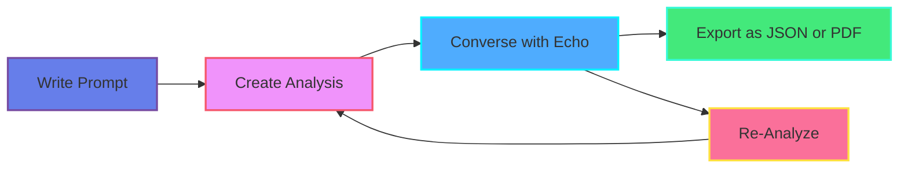
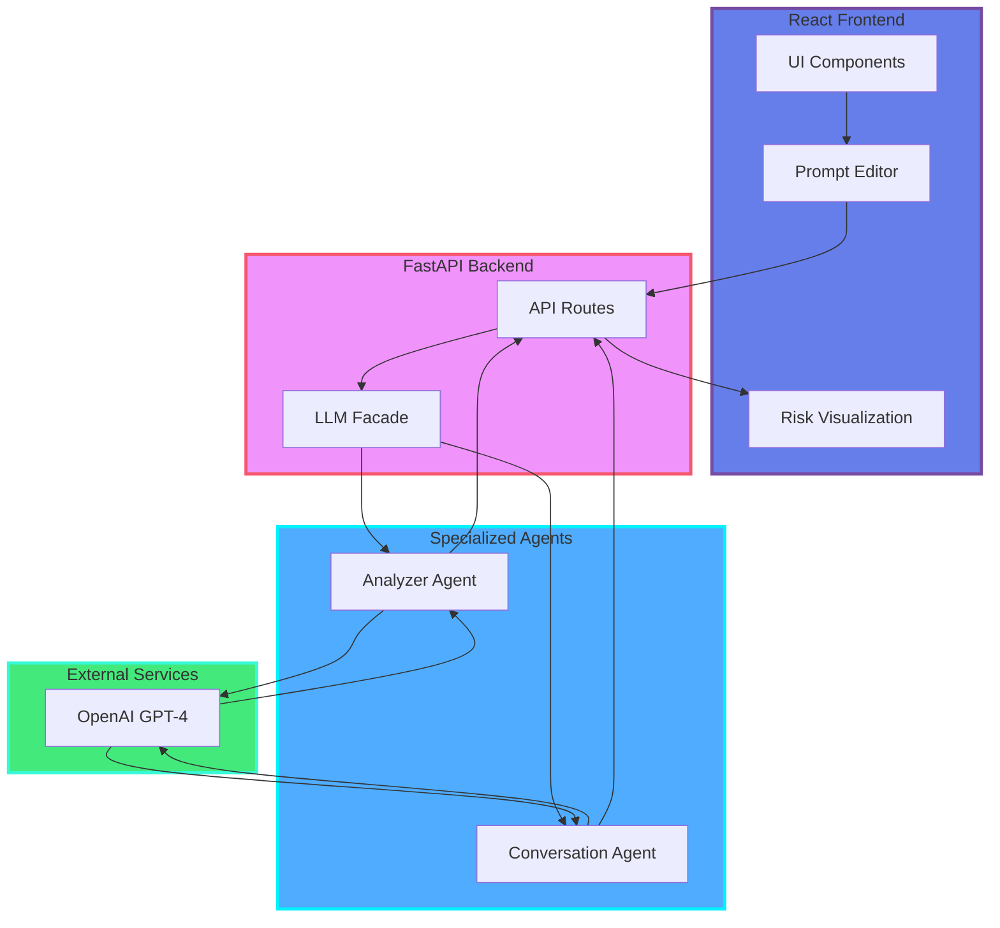

<div align="center">


# Echo
### 🎯 Prompt Risk Intelligence & Human‑Centered Refinement

<strong>Prevent hallucinations at the source: enforce clarity, structure intent, and iterate with transparency.</strong>

[](LICENSE)
[](https://www.python.org/downloads/)
[](https://www.typescriptlang.org/)
[](https://fastapi.tiangolo.com/)
[](https://reactjs.org/)

[🚀 Quick Start](#-quick-start) • [📖 Documentation](#-documentation) • [🎨 Features](#-key-features) • [🏗️ Architecture](#-architecture) • [🤝 Contributing](docs/contributing.md)

</div>

---

## 🌟 Why Echo Exists

LLM hallucinations are frequently **prompt-borne**: ambiguity, missing constraints, vague referents, underspecified outputs. Most tooling reacts **after** generation. Echo shifts left: it analyzes a prompt *before* use, exposing structural risk so the author can refine proactively.

> **💡 Core Philosophy:** Clarity is a controllable input surface. Echo makes it measurable.

### The Problem
- ❌ Vague prompts lead to hallucinated facts
- ❌ Ambiguous audience specifications cause mismatched tone
- ❌ Missing constraints result in off-target responses
- ❌ Post-generation fixes are costly and inefficient

### The Solution
- ✅ **Pre-generation risk analysis** with structured feedback
- ✅ **Token-level highlighting** of problematic spans
- ✅ **Conversational refinement** with context-aware suggestions
- ✅ **Iterative improvement loop** until risk is acceptable

---

## 🎯 What Makes Echo Different

<table>
<thead>
<tr>
<th>Dimension</th>
<th>❌ Conventional Approaches</th>
<th>✅ Echo Approach</th>
</tr>
</thead>
<tbody>
<tr>
<td><strong>Timing</strong></td>
<td>Post-output critique</td>
<td>Pre‑generation risk surfacing</td>
</tr>
<tr>
<td><strong>Explanation</strong></td>
<td>Heuristics or opaque LLM notes</td>
<td>Structured, criterion‑scoped XML + spans</td>
</tr>
<tr>
<td><strong>Consistency</strong></td>
<td>Stochastic judgments</td>
<td>Hybrid LLM extraction + deterministic normalization</td>
</tr>
<tr>
<td><strong>User Agency</strong></td>
<td>One-shot prompts</td>
<td>Iterative refinement loop with targeted deltas</td>
</tr>
<tr>
<td><strong>Traceability</strong></td>
<td>Global score only</td>
<td>Token‑linked <code>RISK_n</code> markers ↔ rendered highlights</td>
</tr>
<tr>
<td><strong>Evolvability</strong></td>
<td>Hard-coded rules</td>
<td>Pluggable criteria & scoring weights</td>
</tr>
</tbody>
</table>

---

## 🔄 User Journey Flow

Echo's workflow is designed for **iterative refinement** through a conversational loop:



### Workflow Steps

| Step | Action | Description |
|------|--------|-------------|
| **1️⃣ Write Prompt** | Draft your prompt in the editor | Type or paste your LLM prompt for analysis |
| **2️⃣ Create Analysis** | Click "Analyze Prompt" | Get structured risk assessment with highlighted spans |
| **3️⃣ Converse** | Chat with Echo assistant | Receive targeted improvement suggestions |
| **4️⃣ Export** | Generate reports | Export analysis as JSON or formatted PDF |
| **5️⃣ Re-Analyze** | Iterate based on context | Re-analyze with full history of previous feedback |

---

## 🎨 Key Features

### 🔍 Intelligent Analysis
- **Token-Level Risk Detection**: Precise identification of problematic spans
- **Multi-Mode Analysis**: Choose between Faithfulness, Factuality, or Both
- **PRD Scoring**: Prompt Risk Density metrics for objective measurement
- **Real-Time Highlighting**: Visual feedback with color-coded risk levels

### 💬 Conversational Refinement
- **Context-Aware Assistant**: Echo understands your prompt's risk profile
- **Iterative Improvement**: Refine through natural conversation
- **History Preservation**: Re-analyze based on previous analysis context
- **Streaming Responses**: Real-time feedback for fluid interaction

### 📊 Professional Reporting
- **Structured JSON Export**: Machine-readable analysis artifacts
- **PDF Generation**: Formatted reports for documentation
- **Risk Metrics Dashboard**: Visual representation of risk distribution
- **Violation Breakdown**: Detailed categorization by criterion

### 🎯 Developer Experience
- **Typed Contracts**: Full TypeScript + Pydantic type safety
- **Hot Reload**: Instant feedback during development
- **Modular Architecture**: Clean separation of concerns
- **Comprehensive Logging**: Structured observability

---

## 🖥️ Interface Overview

### Main Controls

<table>
<thead>
<tr>
<th>Button/Control</th>
<th>Icon</th>
<th>Function</th>
<th>Location</th>
</tr>
</thead>
<tbody>
<tr>
<td><strong>Analyze Prompt</strong></td>
<td>🔍</td>
<td>Triggers risk analysis of current prompt text</td>
<td>Toolbar (primary action)</td>
</tr>
<tr>
<td><strong>Upload File</strong></td>
<td>📁</td>
<td>Load prompt from .txt or .md file</td>
<td>Toolbar</td>
</tr>
<tr>
<td><strong>Clear Editor</strong></td>
<td>🗑️</td>
<td>Reset editor and clear all analysis</td>
<td>Toolbar</td>
</tr>
<tr>
<td><strong>Copy Prompt</strong></td>
<td>📋</td>
<td>Copy current prompt text to clipboard</td>
<td>Toolbar</td>
</tr>
<tr>
<td><strong>Export Analysis</strong></td>
<td>📤</td>
<td>Generate JSON or PDF report of analysis</td>
<td>Analysis panel header</td>
</tr>
<tr>
<td><strong>Theme Toggle</strong></td>
<td>🌙/☀️</td>
<td>Switch between dark and light modes</td>
<td>Top-right header</td>
</tr>
<tr>
<td><strong>Analysis Mode</strong></td>
<td>⚙️</td>
<td>Select: Faithfulness, Factuality, or Both</td>
<td>Analysis panel</td>
</tr>
<tr>
<td><strong>Chat with Echo</strong></td>
<td>💬</td>
<td>Open conversational refinement assistant</td>
<td>Sidebar toggle</td>
</tr>
<tr>
<td><strong>Re-Analyze</strong></td>
<td>🔄</td>
<td>Run analysis again with conversation context</td>
<td>Chat panel footer</td>
</tr>
</tbody>
</table>

### Visual Feedback System

| Element | Meaning | Visual Cue |
|---------|---------|------------|
| 🔴 **Critical Risk** | Severe hallucination risk | Red highlight |
| 🟡 **Medium Risk** | Moderate concern | Yellow highlight |
| 🟢 **Low Risk** | Minor or acceptable | Green badge |
| 📊 **PRD Score** | Prompt Risk Density | 0.0 - 1.0 scale |
| 🎯 **Violation Count** | Issues by category | Numbered badges |

---

## 🏗️ Architecture Overview

Echo employs a **modern full-stack architecture** with specialized agents for different concerns:



### Component Responsibilities

| Layer | Component | Responsibility |
|-------|-----------|----------------|
| **Frontend** | UI Components | User interaction & state management |
| | Editor | Prompt composition & file handling |
| | Visualization | Risk token highlighting & metrics display |
| **Backend** | API Routes | Request validation & response formatting |
| | LLM Facade | Lightweight coordinator (95% size reduction) |
| **Agents** | Analyzer Agent | Hallucination detection & PRD calculation |
| | Conversation Agent | Context-aware prompt refinement |
| **External** | OpenAI GPT | LLM inference for analysis & suggestions |

📖 **Detailed Architecture**: See [`docs/architecture.md`](docs/architecture.md) for in-depth system design.

---

## 🔬 Scoring & Semantics

Each criterion emits a categorical risk (low/medium/high) + percentage. An overall score is derived using weighted aggregation (default equal weighting):

$$
\text{overall} = \text{round}\left(\frac{\sum_i w_i \times p_i}{\sum_i w_i}\right)
$$

Where $p_i$ = criterion percentage (0–100), $w_i$ = weight (default 1.0). High risk tokens typically correspond to criteria with >60% normalized ambiguity/deficit concentration.

### Deterministic Layer Responsibilities
- ✅ Clamp malformed values
- ✅ Enforce integer percentage domain  
- ✅ Provide fallback overall score if XML partial
- ✅ Stable token ID generation

---

## 📡 API Reference

### Core Endpoints

<table>
<thead>
<tr>
<th>Method</th>
<th>Endpoint</th>
<th>Purpose</th>
<th>Returns</th>
</tr>
</thead>
<tbody>
<tr>
<td><code>POST</code></td>
<td><code>/api/analyze/</code></td>
<td>Analyze a prompt for hallucination risk</td>
<td>Risk artifacts bundle</td>
</tr>
<tr>
<td><code>POST</code></td>
<td><code>/api/refine/</code></td>
<td>Non-stream refinement suggestion</td>
<td>Assistant text response</td>
</tr>
<tr>
<td><code>POST</code></td>
<td><code>/api/refine/stream/</code></td>
<td>Streaming conversational refinement</td>
<td>Server-sent events</td>
</tr>
<tr>
<td><code>GET</code></td>
<td><code>/api/health/ping</code></td>
<td>Liveness check</td>
<td><code>{status:"ok"}</code></td>
</tr>
</tbody>
</table>

### Example: Analysis Request

**Request:**
```http
POST /api/analyze/
Content-Type: application/json

{
  "prompt": "Explain quantum computing like I'm a lawyer with examples.",
  "analysis_mode": "both"
}
```

**Response (abridged):**
```json
{
  "annotated_prompt": "Explain <RISK_1>quantum computing</RISK_1> like I'm a <RISK_2>lawyer</RISK_2>...",
  "risk_tokens": [
    {
      "id": "RISK_1",
      "text": "quantum computing",
      "risk_level": "medium",
      "classification": ["complex-domain"],
      "mitigation": "Specify knowledge level or simplify terminology"
    },
    {
      "id": "RISK_2",
      "text": "lawyer",
      "risk_level": "high",
      "classification": ["audience-ambiguity"],
      "mitigation": "Define practice area and experience level"
    }
  ],
  "risk_assessment": {
    "overall_percentage": 58,
    "prompt": {
      "prompt_PRD": 0.0234,
      "prompt_violations": [...],
      "prompt_overview": "Moderate structural risk"
    },
    "meta": {
      "meta_PRD": 0.0156,
      "meta_violations": [...],
      "meta_overview": "Minor instruction ambiguity"
    }
  },
  "analysis_summary": "Prompt mixes domain complexity with unclear audience framing..."
}
```

---

## 📋 Data Contracts

### TypeScript Types

```typescript
type RiskToken = {
  id: string;                              // RISK_#
  text: string;                            // Extracted span
  risk_level: 'low' | 'medium' | 'high';  // Categorical risk
  classification: string[];                // Heuristic labels
  mitigation?: string;                     // Suggested fix
};

type Criterion = {
  name: string;                            // Criterion identifier
  risk: 'low' | 'medium' | 'high';        // Categorical assessment
  percentage: number;                      // 0-100 normalized score
  description?: string;                    // Human-readable explanation
};

interface RiskAssessment {
  overall_percentage: number;              // Weighted aggregate score
  prompt: {
    prompt_PRD: number;                    // Prompt Risk Density
    prompt_violations: Violation[];        // User content issues
    prompt_overview: string;               // Summary
  };
  meta: {
    meta_PRD: number;                      // Meta-instruction PRD
    meta_violations: Violation[];          // Instruction issues
    meta_overview: string;                 // Summary
  };
}

interface AnalysisResponse {
  annotated_prompt: string;                // HTML with RISK_n tags
  risk_tokens: RiskToken[];                // Structured token array
  risk_assessment: RiskAssessment;         // Scoring artifacts
  analysis_summary: string;                // Narrative overview
}
```

### Python Models (Pydantic)

```python
from pydantic import BaseModel
from typing import List, Optional

class RiskToken(BaseModel):
    id: str
    text: str
    risk_level: str
    classification: List[str]
    mitigation: Optional[str] = None

class Criterion(BaseModel):
    name: str
    risk: str
    percentage: int
    description: Optional[str] = None

class AnalysisResponse(BaseModel):
    annotated_prompt: str
    risk_tokens: List[RiskToken]
    risk_assessment: dict
    analysis_summary: str
```

---

## 🚀 Quick Start

### Prerequisites
- **Python** 3.13+ 
- **Node.js** 18+
- **OpenAI API Key** with GPT-4 access

### Installation

```bash
# 1. Clone the repository
git clone https://github.com/MoNejjar/echo-hallucination-detect.git
cd echo-hallucination-detect

# 2. Configure environment
cp .env.example .env
# Edit .env and add your OPENAI_API_KEY

# 3. Setup Python backend
python -m venv .venv
.\.venv\Scripts\activate  # Windows PowerShell
# On macOS/Linux: source .venv/bin/activate
pip install -r server/requirements.txt

# 4. Start the backend server
python start_server.py
# Server runs on http://localhost:8000

# 5. In a new terminal, setup frontend
cd client
npm install

# 6. Start the development server
npm run dev
# Frontend runs on http://localhost:5173
```

### Quick Test

```bash
# Health check
curl http://localhost:8000/api/health/ping

# Analyze a prompt
curl -X POST http://localhost:8000/api/analyze/ \
  -H "Content-Type: application/json" \
  -d '{"prompt":"Explain AI to me","analysis_mode":"both"}'
```

---

## 📚 Documentation

| Document | Description |
|----------|-------------|
| [**Architecture**](docs/architecture.md) | System design, data flow, and technical decisions |
| [**User Flow**](docs/user_flow.md) | Complete user journey and interaction patterns |
| [**System Flow**](docs/complete_system_flow.md) | End-to-end request flow diagrams |
| [**LLM Refactoring**](docs/llm_refactoring.md) | Agent architecture and code organization |
| [**Contributing**](docs/contributing.md) | Development guidelines and contribution process |
| [**Hallucination Docs**](docs/hallucination_documentation.md) | Detection methodology and research context |

---

## 🧪 Testing & Evaluation

### Quality Assurance

Deterministic post‑processing ensures **stable scores** across identical inputs:

| Aspect | Implementation | Benefit |
|--------|----------------|---------|
| **Repeatability** | Deterministic scoring layer | Same prompt → Same risk score |
| **Transparency** | Open criteria + weights | Explainable assessments |
| **Regression Testing** | Prompt corpus validation | Detect model drift |
| **Human Alignment** | Inter-rater reliability studies | Validate against expert judgments |

### Future Evaluation Roadmap

- [ ] **Prompt Corpus Benchmarking** - Track performance across diverse domains
- [ ] **Human Expert Comparison** - Inter-rater alignment validation
- [ ] **LLM Provider Drift Detection** - Monitor consistency across API versions
- [ ] **A/B Testing Framework** - Compare refinement strategies
- [ ] **Production Metrics** - Real-world usage analytics

### Running Tests

```bash
# Backend unit tests
cd server
pytest tests/ -v --cov=server

# Frontend tests
cd client
npm run test

# Integration tests (if configured)
npm run test:integration
```

---

## 🤝 Contributing

We welcome contributions! Please see our [**Contributing Guide**](docs/contributing.md) for details.

### Quick Contribution Steps

1. 🍴 **Fork** the repository
2. 🌿 **Create** a feature branch: `git checkout -b feature/amazing-feature`
3. ✍️ **Commit** your changes: `git commit -m 'Add amazing feature'`
4. 📤 **Push** to the branch: `git push origin feature/amazing-feature`
5. 🔀 **Open** a Pull Request

### Development Guidelines

- ✅ Follow the existing code style (TypeScript + Python)
- ✅ Write tests for new features
- ✅ Update documentation as needed
- ✅ Keep commits atomic and well-described
- ✅ Ensure CI checks pass before submitting PR

---

## 🗺️ Roadmap

| Theme | Planned Direction |
|-------|-------------------|
| **Explainability** | Per‑token rationale chains with evidence linking |
| **Ensembles** | Cross‑model disagreement surfacing for robustness |
| **Batch Analysis** | Multi‑prompt comparison dashboard with diff view |
| **Persistence** | Historical trend tracking & delta graphs |
| **Domain Packs** | Legal / Medical / Finance specific criteria modules |
| **Export** | Enhanced PDF/Markdown reporting with visualizations |
| **Integration** | VSCode extension & CLI tools |
| **Multi-Language** | Support for prompts in multiple languages |

---

## 💡 FAQ

<details>
<summary><strong>Q: Why not just rely on the LLM to self‑critique?</strong></summary>

Self‑critique inherits the same ambiguity surface as the original prompt. Echo's hybrid approach combines LLM extraction with deterministic overlays to add stability and consistency.
</details>

<details>
<summary><strong>Q: Does this prevent all hallucinations?</strong></summary>

No—Echo reduces *prompt‑induced* risk factors. Model internals remain stochastic, so there's no guarantee against all hallucinations, but well-structured prompts significantly reduce risk.
</details>

<details>
<summary><strong>Q: Can I swap the LLM provider?</strong></summary>

Yes—`server/services/llm.py` isolates the OpenAI calls. You can implement an alternate adapter for Anthropic, Azure OpenAI, or other providers.
</details>

<details>
<summary><strong>Q: Are scores comparable across domains?</strong></summary>

Within consistent criteria configuration, yes. Domain-specific packs (planned) will version criteria for specialized contexts like legal or medical domains.
</details>

<details>
<summary><strong>Q: Why XML instead of JSON for risk assessment?</strong></summary>

XML tagging prevents the model from collapsing structure and pairs well with embedded span tags (`<RISK_n>`). It maintains better fidelity for hierarchical risk annotations.
</details>

<details>
<summary><strong>Q: Is streaming supported?</strong></summary>

Yes! The `/api/refine/stream/` endpoint supports server-sent events for real-time conversational refinement feedback.
</details>

---

## 📜 License

This project is licensed under the **MIT License** - see the [LICENSE](LICENSE) file for details.

---

## 🌟 Research Context & Citation

Developed as part of a **Bachelor's Thesis** at the **Technical University of Munich (TUM)** on proactive hallucination mitigation through prompt-surface analysis.

### Citation

If you use this work in your research, please cite:

```bibtex
@thesis{nejjar2025echo,
  author = {Nejjar, Mohamed},
  title = {Echo: A Hybrid LLM + Deterministic System for Prompt Risk Intelligence and Refinement},
  school = {Technical University of Munich},
  year = {2025},
  type = {Bachelor's Thesis},
  url = {https://github.com/MoNejjar/echo-hallucination-detect}
}
```

---

## 📧 Contact & Support

- **Author**: Mohamed Nejjar
- **Email**: mohamed.nejjar@tum.de
- **Issues**: [GitHub Issues](https://github.com/MoNejjar/echo-hallucination-detect/issues)
- **Discussions**: [GitHub Discussions](https://github.com/MoNejjar/echo-hallucination-detect/discussions)

---

<div align="center">

**Built with curiosity. Refined through iteration. Aimed at clarity.**

⭐ Star this repo if Echo helps improve your prompts!

</div>
