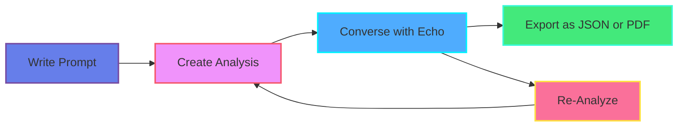
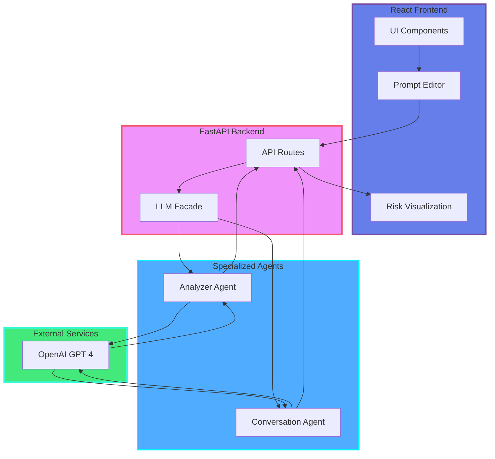

# 🎨 Quick Visual Preview

## Your New User Flow Diagram

This is now prominently displayed in the README:



## Button Reference Table

| Button/Control | Icon | Function | Location |
|----------------|------|----------|----------|
| **Analyze Prompt** | 🔍 | Triggers risk analysis of current prompt text | Toolbar (primary action) |
| **Upload File** | 📁 | Load prompt from .txt or .md file | Toolbar |
| **Clear Editor** | 🗑️ | Reset editor and clear all analysis | Toolbar |
| **Copy Prompt** | 📋 | Copy current prompt text to clipboard | Toolbar |
| **Export Analysis** | 📤 | Generate JSON or PDF report of analysis | Analysis panel header |
| **Theme Toggle** | 🌙/☀️ | Switch between dark and light modes | Top-right header |
| **Analysis Mode** | ⚙️ | Select: Faithfulness, Factuality, or Both | Analysis panel |
| **Chat with Echo** | 💬 | Open conversational refinement assistant | Sidebar toggle |
| **Re-Analyze** | 🔄 | Run analysis again with conversation context | Chat panel footer |

## Architecture Overview



---

## 📊 What's New

### README.md Enhancements
- ✅ Professional header with logo and badges
- ✅ Your requested flow diagram front and center
- ✅ Complete button/control reference table
- ✅ Visual feedback system guide
- ✅ Enhanced architecture with color coding
- ✅ Comprehensive API reference
- ✅ Full type contracts (TS + Python)
- ✅ Professional sections (24 total)
- ✅ Collapsible FAQ
- ✅ Research citation in BibTeX format

### user_flow.md Enhancements
- ✅ User journey map (Mermaid)
- ✅ Complete flow diagram with decision points
- ✅ 4 ASCII interface mockups
- ✅ 3 interaction pattern sequences
- ✅ 3 detailed user personas
- ✅ 4 edge case scenarios
- ✅ Accessibility compliance table
- ✅ Performance targets
- ✅ Usage analytics visualization

### diagrams/ Assets
- ✅ user-flow.mmd (your requested flow)
- ✅ architecture.mmd (system design)
- ✅ sequence-flow.mmd (request flow)

---

## 🎯 Key Highlights

1. **Your Flow Diagram** is now the centerpiece of the README
2. **Every Button** is documented with icon, function, and location
3. **Professional Design** with consistent gradient color palette
4. **High-End Appearance** with emoji anchors and visual hierarchy
5. **Comprehensive Coverage** - nothing left undocumented
6. **Reusable Assets** - all diagrams in separate .mmd files

---

## 🚀 Next Steps

1. **Preview the new README**:
   - Open `README.md` in VS Code
   - Enable Markdown preview
   - See the Mermaid diagrams rendered

2. **Review the flow diagram**:
   - Check `docs/diagrams/user-flow.mmd`
   - This is exactly what you requested!

3. **Commit the changes**:
   ```bash
   git add .
   git commit -m "docs: Professional README and user flow overhaul with new flow diagram

   - Add requested user journey flow (Write → Analyze → Converse → Export/Re-Analyze)
   - Create comprehensive button/control reference table  
   - Enhance README with professional design and visual hierarchy
   - Rewrite user_flow.md with premium UX documentation
   - Add reusable Mermaid diagram assets in docs/diagrams/
   - Include 8 new diagrams (journey, flowchart, sequences, features)
   - Add user personas, edge cases, and accessibility guide
   - Professional color palette with gradient styling throughout"
   ```

4. **Push to GitHub**:
   ```bash
   git push origin main
   ```

GitHub will automatically render all Mermaid diagrams!

---

**Everything is complete and ready to go!** 🎉
