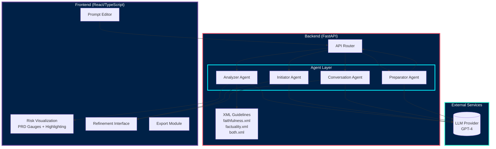
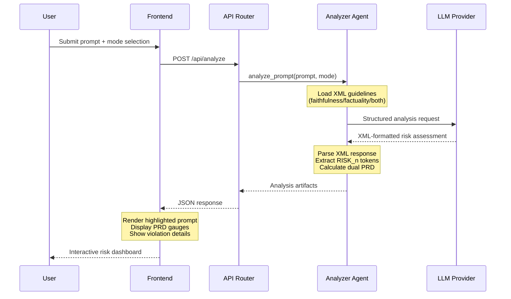
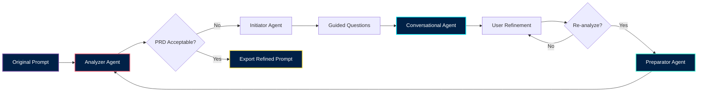

<div align="center">

# Echo: System Architecture & Technical Implementation

### A Shift-Left Framework for User-Sided Hallucination Mitigation in Large Language Models

*Mohamed Nejjar — Bachelor Thesis: "Mitigating Hallucination Potential in User Prompts Through AI-Guided Iterative Refinement"*

</div>

---

## Abstract

This document presents the technical architecture of **Echo**, a novel solution design implementing a shift-left methodology for hallucination mitigation in Large Language Model (LLM) interactions. Unlike existing approaches that focus on post-generation detection or model-side improvements, Echo addresses the underexplored domain of **user-sided error sources**—specifically, how prompt formulation contributes to hallucination potential before generation occurs.

The system operationalizes a new theoretical taxonomy distinguishing between **prompt-level** and **meta-level** risks, each further subdivided into **faithfulness** and **factuality** dimensions. Through a multi-agent architecture comprising Analyzer, Initiator, Conversational, and Preparator agents, Echo provides quantitative risk assessment via the novel **Prompt Risk Density (PRD)** metric, enabling systematic prompt refinement through human-AI collaboration.

---

## 1. Theoretical Foundation

### 1.1 Reconceptualizing Hallucination Sources

Traditional hallucination research focuses predominantly on **LLM-sided errors**—issues arising from training data quality, model architecture limitations, knowledge cutoff boundaries, and inference mechanisms. However, this perspective overlooks a fundamental contributor to hallucination generation: **the user**.

Echo is grounded in a novel dual-actor model of hallucination causation:

```
┌─────────────────────────────────────────────────────────────────────────┐
│                    HALLUCINATION SOURCE TAXONOMY                        │
├─────────────────────────────────┬───────────────────────────────────────┤
│         LLM-SIDED ERRORS        │         USER-SIDED ERRORS             │
│  (Out of scope for this work)   │      (Echo's intervention domain)     │
├─────────────────────────────────┼───────────────────────────────────────┤
│  • Training data artifacts      │              ┌───────────────────────┐│
│  • Model architecture limits    │              │   PROMPT-LEVEL RISKS  ││
│  • Knowledge cutoff boundaries  │              │  ─────────────────────││
│  • Inference temperature        │              │ Token-addressable     ││
│  • Attention mechanism drift    │              │ 1:1 risk mapping      ││
│                                 │              │ Directly highlightable││
│                                 │              └───────────┬───────────┘│
│                                 │                          │            │
│                                 │              ┌───────────┴───────────┐│
│                                 │              │    META-LEVEL RISKS   ││
│                                 │              │  ─────────────────────││
│                                 │              │ Structural in nature  ││
│                                 │              │ Context/actor gaps    ││
│                                 │              │ Cannot be tokenized   ││
│                                 │              └───────────────────────┘│
└─────────────────────────────────┴───────────────────────────────────────┘
```

### 1.2 The Prompt vs. Meta Risk Dichotomy (Novel Contribution)

A key theoretical contribution is the **middle-level taxonomy** distinguishing prompt-level from meta-level risks:

| Dimension | Prompt-Level Risks | Meta-Level Risks |
|-----------|-------------------|------------------|
| **Nature** | Lexical, syntactic, semantic | Structural, contextual, relational |
| **Addressability** | Token-specific (highlightable) | Holistic (non-localizable) |
| **Examples** | Ambiguous pronouns, vague quantifiers, unitless numbers | Missing actors, conflicting constraints, absent context |
| **Detection** | Pattern matching + NLP analysis | Structural analysis + inference |
| **Visualization** | Direct span highlighting | Aggregate gauges + explanatory text |

### 1.3 Faithfulness vs. Factuality at the Leaf Level

At the lowest taxonomy level, both prompt and meta risks subdivide into established categories (building on prior research):

- **Faithfulness Risks**: Potential for the LLM to deviate from user-provided context, instructions, or constraints
- **Factuality Risks**: Potential for the LLM to generate claims contradicting real-world knowledge

**Key Insight**: While market-leading LLMs increasingly resist factuality hallucinations (refusing uncertain claims), faithfulness hallucinations remain intractable because they depend fundamentally on **how users formulate prompts**—a problem no model architecture can fully solve.

### 1.4 The Shift-Left Paradigm

Echo implements a **shift-left methodology** analogous to security and quality assurance paradigms:

```
Traditional Approach:          Echo's Shift-Left Approach:
─────────────────────         ──────────────────────────────
User Prompt → LLM → Output    User Prompt → ECHO ANALYSIS → Refined Prompt → LLM → Output
                ↓                              ↓
         Hallucination             Risk Detection & Mitigation
         (Post-hoc detection)      (Pre-generation prevention)
```

By intervening **before** generation, Echo eliminates one entire error source (user-sided), potentially enabling smaller, more accessible models to achieve hallucination robustness comparable to closed-source systems.

---

## 2. The Prompt Risk Density (PRD) Metric

### 2.1 Motivation and Design

The **Prompt Risk Density (PRD)** is a novel quantitative metric inspired by percentage-based risk analysis methodologies used in finance, security, and quality assurance domains. PRD measures the relative hallucination-inducing potential of a prompt by calculating the density of risky linguistic elements.

### 2.2 Mathematical Formulation

$$PRD = \frac{\sum_{i=1}^{n} (L_i \times S_i)}{P_{total}} \times 100$$

Where:
- $L_i$ = Length (token span) of the $i$-th risk element
- $S_i$ = Severity weight of the $i$-th risk element
- $P_{total}$ = Total prompt length in tokens
- $n$ = Number of identified risk elements

**Severity Weights:**
| Level | Weight ($S_i$) | Interpretation |
|-------|----------------|----------------|
| Medium | 1 | Potential for minor hallucination |
| High | 2 | Significant hallucination likelihood |
| Critical | 3 | High probability of severe hallucination |

### 2.3 Dual PRD Computation

Echo computes **two distinct PRD values**:

1. **Prompt PRD**: Measures density of token-level risks (ambiguous references, vague quantifiers, etc.)
2. **Meta PRD**: Measures structural/contextual risks (missing actors, conflicting constraints, etc.)

This dual-gauge visualization enables users to understand **where** their prompt needs improvement—at the linguistic level or the structural level.

---

## 3. Multi-Agent Architecture

### 3.1 Agent Pipeline Overview

Echo implements a **semi-human-assisted multi-step workflow** through four specialized agents:

```
┌──────────────────────────────────────────────────────────────────────────────┐
│                           ECHO AGENT PIPELINE                                │
├──────────────────────────────────────────────────────────────────────────────┤
│                                                                              │
│  ┌─────────────────┐    ┌─────────────────┐    ┌─────────────────────────┐   │
│  │  1. ANALYZER    │───▶│  2. INITIATOR   │───▶│  3. CONVERSATIONAL     │   │
│  │     AGENT       │    │     AGENT       │    │     AGENT              │   │
│  ├─────────────────┤    ├─────────────────┤    ├─────────────────────────┤   │
│  │ • Risk scanning │    │ • Question      │    │ • Interactive          │   │
│  │ • PRD calc      │    │   generation    │    │   refinement           │   │
│  │ • Token mapping │    │ • Guided start  │    │ • Critical feedback    │   │
│  │ • Highlighting  │    │   points        │    │ • Guideline adherence  │   │
│  └─────────────────┘    └─────────────────┘    └───────────┬─────────────┘   │
│                                                            │                 │
│                                           ┌────────────────▼─────────────┐   │
│                                           │     4. PREPARATOR AGENT      │   │
│                                           ├──────────────────────────────┤   │
│                                           │ • Prompt synthesis           │   │
│                                           │ • Version generation         │   │
│                                           │ • Re-analysis preparation    │   │
│                                           └──────────────────────────────┘   │
│                                                                              │
└──────────────────────────────────────────────────────────────────────────────┘
```

### 3.2 Agent Specifications

#### 3.2.1 Analyzer Agent (`services/analyzer_agent.py`)

**Purpose**: Primary risk detection and quantification engine

**Responsibilities**:
- Parse user prompts against XML-encoded detection guidelines
- Identify hallucination-inducing tokens and structural patterns
- Generate annotated prompts with `<RISK_n>` span markers
- Calculate prompt-level and meta-level PRD scores
- Produce detailed token-to-rule mappings

**Output Artifacts**:
```json
{
  "annotated_prompt": "Analyze <RISK_1>this data</RISK_1> for <RISK_2>recent</RISK_2> trends",
  "risk_tokens": [
    {
      "id": "RISK_1",
      "text": "this data",
      "risk_level": "high",
      "classification": "Ambiguous Referent",
      "rule_ids": [101],
      "pillar": "A",
      "mitigation": "Replace with specific dataset identifier"
    }
  ],
  "risk_assessment": {
    "prompt_prd": 42.5,
    "meta_prd": 28.3,
    "prompt_violations": [...],
    "meta_violations": [...]
  }
}
```

#### 3.2.2 Initiator Agent (`services/initiator_agent.py`)

**Purpose**: Generate guided starting points for user-driven refinement

**Responsibilities**:
- Analyze detected violations from Analyzer output
- Generate **one targeted question per broken rule**
- Prioritize questions by severity (critical → high → medium)
- Provide actionable entry points for refinement conversation

**Example Output**:
```
Based on the analysis, consider these refinement starting points:

1. [CRITICAL] The reference "this data" lacks specificity. What specific 
   dataset, document, or information source are you referring to?

2. [HIGH] The temporal reference "recent" is ambiguous. What specific 
   time period (e.g., Q3 2024, last 6 months) should constrain the analysis?

3. [MEDIUM] No target audience is specified. Who will consume this output—
   technical experts, executives, or general audiences?
```

#### 3.2.3 Conversational Agent (`services/conversation_agent.py`)

**Purpose**: Interactive prompt refinement through guided dialogue

**Responsibilities**:
- Maintain conversation context with full analysis awareness
- Provide **critical, guideline-adherent feedback** (not a "yes-man")
- Suggest specific improvements based on detected risks
- Track refinement progress across conversation turns
- Support streaming responses for real-time interaction

**Design Philosophy**: The agent is explicitly designed to remain **critical** and **truthful to the guidelines**—it does not simply agree with user suggestions but evaluates them against the hallucination mitigation taxonomy.

#### 3.2.4 Preparator Agent (`services/preparator.py`)

**Purpose**: Synthesize refined prompts for re-analysis cycles

**Responsibilities**:
- Integrate conversation insights with original prompt
- Apply discussed mitigation strategies
- Generate alternative prompt versions
- Prepare prompts for fresh analysis cycles
- **Critical constraint**: Uses conversation as semantic context only—does not copy conversation text into prompts

---

## 4. System Topology

### 4.1 High-Level Architecture



### 4.2 API Endpoint Structure

| Endpoint | Method | Purpose | Agent Invoked |
|----------|--------|---------|---------------|
| `/api/analyze` | POST | Primary risk analysis | Analyzer Agent |
| `/api/initiate` | POST | Generate guided questions | Initiator Agent |
| `/api/refine` | POST | Single-turn refinement | Conversation Agent |
| `/api/refine/stream` | GET | Streaming refinement | Conversation Agent |
| `/api/prepare` | POST | Synthesize refined prompt | Preparator Agent |
| `/api/health` | GET | Service liveness probe | — |

### 4.3 Analysis Modes

Echo supports three analysis configurations based on the faithfulness/factuality taxonomy:

| Mode | Guideline File | Focus | Use Case |
|------|----------------|-------|----------|
| **Faithfulness** | `faithfulness.xml` | Context adherence risks | Verify prompt will keep model faithful to provided information |
| **Factuality** | `factuality.xml` | Real-world accuracy risks | Identify elements likely to trigger factual fabrication |
| **Both** (Default) | `both.xml` | Comprehensive analysis | Full risk assessment across both dimensions |

---

## 5. Processing Pipeline

### 5.1 Analysis Sequence



### 5.2 Iterative Refinement Cycle



---

## 6. Risk Visualization System

### 6.1 Highlighting Mechanism

The frontend implements a three-tier visual highlighting system:

| Severity | Color | CSS Class | Interpretation |
|----------|-------|-----------|----------------|
| **Critical** | Red | `risk-critical` | Immediate attention required |
| **High** | Orange | `risk-high` | Significant refinement recommended |
| **Medium** | Yellow | `risk-medium` | Optional improvement suggested |

### 6.2 Token Binding Algorithm

```typescript
// Simplified highlighting logic
function renderAnnotatedPrompt(annotatedPrompt: string, riskTokens: RiskToken[]) {
  // Split on RISK_n markers
  const segments = annotatedPrompt.split(/(<RISK_\d+>.*?<\/RISK_\d+>)/);
  
  return segments.map(segment => {
    const match = segment.match(/<RISK_(\d+)>(.*?)<\/RISK_\d+>/);
    if (match) {
      const [_, riskId, text] = match;
      const token = riskTokens.find(t => t.id === `RISK_${riskId}`);
      return <span className={getRiskClass(token?.risk_level)}>{text}</span>;
    }
    return segment;
  });
}
```

### 6.3 PRD Gauge Visualization

The dual-gauge display provides at-a-glance assessment:

```
┌──────────────────────────────────────────────┐
│           PROMPT RISK DENSITY                │
├──────────────────────────────────────────────┤
│                                              │
│  Prompt PRD          Meta PRD                │
│  ┌────────┐          ┌────────┐              │
│  │   42%  │          │   28%  │              │
│  │  ████░░│          │  ███░░░│              │
│  └────────┘          └────────┘              │
│  Token-level         Structural              │
│  risks               risks                   │
│                                              │
└──────────────────────────────────────────────┘
```

---

## 7. Guideline-Driven Detection

### 7.1 XML Guideline Structure

Detection rules are encoded in XML for maintainability and extensibility:

```xml
<HALLUCINATION_GUIDELINES version="2.0">
  <PILLAR id="A" name="Referential Grounding" class="prompt-level">
    <RULE id="A1" severity="critical">
      <NAME>Ambiguous Referents</NAME>
      <PATTERNS>
        <PATTERN>Pronouns without clear antecedents</PATTERN>
        <PATTERN>Deictic references missing grounding</PATTERN>
      </PATTERNS>
      <EXAMPLES>
        <BAD>It should be summarized.</BAD>
        <GOOD>The Q3 financial report should be summarized.</GOOD>
      </EXAMPLES>
      <MITIGATION>Replace pronouns with explicit nouns</MITIGATION>
    </RULE>
  </PILLAR>
</HALLUCINATION_GUIDELINES>
```

### 7.2 The 12 Pillars

Echo's detection taxonomy comprises 12 pillars spanning prompt-level and meta-level risks:

| Pillar | Name | Class | Focus |
|--------|------|-------|-------|
| A | Referential Grounding | Prompt | Pronouns, deixis, naming consistency |
| B | Quantification Constraints | Prompt | Vague quantifiers, temporal references |
| C | Context-Domain | Meta | Missing essentials (who/what/when/where) |
| D | Premises-Evidence | Prompt | False premises, leading framing |
| E | Numbers-Units | Prompt | Unitless values, missing baselines |
| F | Retrieval-Anchoring | Prompt | Source specification, document identifiers |
| G | Injection-Layering | Meta | Contradictions, instruction duplication |
| H | Style-Bias-Role | Prompt | Style inflation, stereotypes, unsafe roleplay |
| I | Reasoning-Uncertainty | Prompt | Uncertainty permission, subjective framing |
| J | Prompt-Structure | Meta | Length, delimiters, objective overload |
| K | Instruction-Structure | Meta | Task delimitation, step enumeration |
| L | Contextual-Integrity | Prompt | Conflicting instructions, negation risks |

---

## 8. Data Contracts

### 8.1 TypeScript Interfaces (Frontend)

```typescript
interface RiskToken {
  id: string;                    // RISK_1, RISK_2, ...
  text: string;                  // Highlighted span content
  risk_level: 'critical' | 'high' | 'medium' | 'low';
  classification: string;        // Rule category
  rule_ids: number[];           // Guideline rule references
  pillar: string;               // A-L pillar identifier
  mitigation?: string;          // Suggested fix
}

interface PRDAssessment {
  prompt_prd: number;           // 0-100 scale
  meta_prd: number;             // 0-100 scale
  prompt_violations: Violation[];
  meta_violations: Violation[];
}

interface AnalysisResponse {
  annotated_prompt: string;
  risk_tokens: RiskToken[];
  risk_assessment: PRDAssessment;
  analysis_summary: string;
  initiator_questions?: string[];
}
```

### 8.2 Pydantic Models (Backend)

```python
class RiskToken(BaseModel):
    id: str
    text: str
    risk_level: Literal["critical", "high", "medium", "low"]
    classification: str
    rule_ids: List[int]
    pillar: str
    mitigation: Optional[str] = None

class PRDAssessment(BaseModel):
    prompt_prd: float
    meta_prd: float
    prompt_violations: List[Violation]
    meta_violations: List[Violation]

class AnalysisResponse(BaseModel):
    annotated_prompt: str
    risk_tokens: List[RiskToken]
    risk_assessment: PRDAssessment
    analysis_summary: str
    initiator_questions: Optional[List[str]] = None
```

---

## 9. Operational Considerations

### 9.1 Security Posture

| Vector | Current State | Production Recommendation |
|--------|---------------|---------------------------|
| API Keys | Environment variables | Secret manager (Vault, AWS Secrets) |
| CORS | Development permissive | Strict origin allowlist |
| Input Validation | Basic sanitization | Length caps, injection prevention |
| Rate Limiting | None | Per-user quotas, API key auth |
| Transport | HTTP (local) | TLS 1.3 enforcement |

### 9.2 Observability

Recommended instrumentation:
- **Structured logging**: JSON format for ELK/Splunk ingestion
- **Metrics**: PRD distribution, analysis latency, agent invocation counts
- **Tracing**: OpenTelemetry spans for LLM round-trip analysis

### 9.3 Scalability

| Component | Current | Scale Strategy |
|-----------|---------|----------------|
| Frontend | SPA | CDN + code splitting |
| API | Single FastAPI instance | Horizontal scaling + load balancer |
| LLM Calls | Direct provider | Request queuing + caching layer |
| State | Stateless | Redis for session caching if needed |

---

## 10. Research Implications

### 10.1 Contribution to Hallucination Research

Echo's architecture demonstrates:

1. **Feasibility of pre-generation intervention**: User-sided risks can be systematically detected and quantified
2. **Practical taxonomy operationalization**: The prompt/meta and faithfulness/factuality taxonomies can be encoded into actionable detection rules
3. **Human-AI collaboration for quality**: Semi-automated workflows preserve human judgment while providing systematic guidance

### 10.2 Implications for Model Accessibility

By shifting hallucination mitigation to the prompt level, Echo potentially:
- Enables smaller, open-source models to achieve comparable faithfulness to large proprietary systems
- Reduces dependency on expensive, closed-source models for high-stakes applications
- Democratizes hallucination-robust AI interactions

---

## 11. Future Directions

| Theme | Description |
|-------|-------------|
| **Multi-model support** | Abstract LLM provider for Anthropic, local models |
| **Evaluation harness** | Benchmark PRD correlation with actual hallucination rates |
| **Collaborative refinement** | Shared sessions, annotation comments |
| **Domain adaptation** | Custom guideline sets for legal, medical, technical domains |
| **Longitudinal tracking** | Prompt quality evolution over time |

---

## References

- See `docs/user_flow.md` for user experience documentation
- See `docs/hallucination_documentation.md` for complete guideline taxonomy
- See `docs/diagrams/` for source Mermaid files

---

*Echo — "Every hallucination avoided begins with a clearer prompt."*

*© 2025 Mohamed Nejjar — Bachelor Thesis Implementation*
