<div align="center">

# 📐 Echo Hallucination Detection – System Architecture

*An end‑to‑end prompt risk intelligence and refinement platform for reducing LLM hallucinations.*

</div>

---

## 1. Executive Overview

Echo transforms an unstructured natural‑language prompt into a **structured risk profile**, annotated **high / medium risk spans**, and **actionable refinement guidance**—all in a tight human‑in‑the‑loop workflow.

The platform is architected as a **React + TypeScript single‑page client** backed by a **FastAPI service layer** that orchestrates an **LLM analysis pipeline**, applies **deterministic scoring heuristics**, and returns **machine + human readable artifacts** for visualization and iterative improvement.

Key design principles:

| Principle | Implementation Expression |
|-----------|---------------------------|
| Determinism over opacity | Hybrid: LLM extraction + rule post‑processing |
| Fast feedback loop | Stateless idempotent `/analyze` flow + lightweight streaming `/refine` |
| Progressive disclosure | Collapsible UI sections & semantic grouping |
| Traceable highlighting | Stable `RISK_n` tag emission → structured token list → color map |
| Evolvable scoring model | Criteria array + pluggable heuristics |

---

## 2. High‑Level System Topology

Canonical Mermaid source: `docs/diagrams/topology.mmd`

```mermaid
%% (Inline copy for immediate readability – edit the .mmd source.)
flowchart TB
  subgraph Browser[Client - React / Vite]
    UI[Prompt Editor & Panels]
    HL[Highlight Renderer]
    Chat[Refinement Chat]
    ReAnalyze[Re-Analyze Dialog]
    APIClient[Typed API Layer]
  end

  subgraph API[FastAPI Backend]
    Router[Route Layer]
    AnalyzeRoute["/api/analyze"]
    RefineRoute["/api/refine"]
    PrepareRoute["/api/prepare"]
    
    subgraph Agents[Specialized Agents]
      LLMFacade[LLM Facade]
      AnalyzerAgent[Analyzer Agent]
      ConversationAgent[Conversation Agent]
      Preparator[Preparator Service]
    end
    
    Logger[Structured Logger]
  end

  subgraph OpenAI[External LLM]
    GPT[(GPT-4)]
  end

  UI --> APIClient
  Chat --> APIClient
  ReAnalyze --> APIClient
  
  APIClient --> Router
  Router --> AnalyzeRoute
  Router --> RefineRoute
  Router --> PrepareRoute
  
  AnalyzeRoute --> LLMFacade
  RefineRoute --> LLMFacade
  PrepareRoute --> Preparator
  
  LLMFacade --> AnalyzerAgent
  LLMFacade --> ConversationAgent
  
  AnalyzerAgent --> GPT
  ConversationAgent --> GPT
  Preparator --> GPT
  
  GPT --> AnalyzerAgent
  GPT --> ConversationAgent
  GPT --> Preparator
  
  AnalyzerAgent --> AnalyzeRoute
  ConversationAgent --> RefineRoute
  Preparator --> PrepareRoute
  
  AnalyzeRoute --> APIClient --> HL
  RefineRoute --> APIClient --> Chat
  PrepareRoute --> APIClient --> ReAnalyze
  
  Logger -. observability .- Router
```



**Data Products Returned:**
1. `annotated_prompt` – Original text with stable `<RISK_i> … </RISK_i>` span markers.
2. `risk_tokens[]` – Array containing: id (`RISK_i`), text, classification rule(s), risk_level.
3. `risk_assessment` – Structured criteria + overall percentage.
4. `analysis_summary` – Narrative condensation for quick human scanning.

---

## 3. Detailed Processing Pipeline

Canonical Mermaid source: `docs/diagrams/pipeline-sequence.mmd`

```mermaid
%% (Inline copy – edit the .mmd source for changes.)
sequenceDiagram
  participant U as User
  participant FE as Frontend
  participant Route as /api/analyze
  participant Facade as LLM Facade
  participant Analyzer as Analyzer Agent
  participant MODEL as OpenAI GPT

  U->>FE: Click "Analyze"
  FE->>Route: POST /api/analyze { prompt, mode }
  Route->>Facade: analyze_prompt(prompt, mode)
  Facade->>Analyzer: analyze_prompt(prompt, mode)
  
  Note over Analyzer: Load guidelines XML<br/>(faithfulness/factuality/both)
  
  Analyzer->>MODEL: completion request with guidelines
  MODEL-->>Analyzer: raw structured response
  
  Note over Analyzer: Parse XML risk assessment<br/>Extract RISK_n tokens<br/>Calculate PRD scores
  
  Analyzer-->>Facade: analyzed data
  Facade-->>Route: {annotated_prompt, risk_tokens, risk_assessment}
  Route-->>FE: JSON artifacts
  
  Note over FE: Map RISK_n → color classes<br/>Render highlighted view
  
  FE-->>U: Highlighted analysis + risk dashboard
```



### Core Phases
| Phase | Responsibility | Guarantees |
|-------|----------------|------------|
| Sanitization | Strip control chars / trim / ensure UTF‑8 | Prevent injection & noise |
| LLM Extraction | Produce raw spans + XML criteria | Structured envelope contract |
| Parsing | Convert XML + tagged markup to Python objects | Fault‑tolerant fallback |
| Deterministic Scoring | Apply rule weighting / normalization | Stable numerical outputs |
| Token Binding | FE binds `<RISK_n>` tags to `risk_tokens` | Deterministic highlighting |

---

## 4. Backend Service Layer

### Routes
| Module | File | Responsibility | Notable Details |
|--------|------|----------------|-----------------|
| App entry | `server/main.py` | App factory, CORS, router registration | Mounts `/api/*` namespace with health, analyze, refine, prepare |
| Routes – health | `routes/health.py` | Health check endpoint | Simple liveness probe at `/api/health/` |
| Routes – analysis | `routes/analyze.py` | Accept prompt, orchestrate pipeline | `POST /api/analyze/` - Returns all analysis artifacts |
| Routes – refinement | `routes/refine.py` | Conversational improvement | `POST /api/refine/` and `GET /api/refine/stream` |
| Routes – preparation | `routes/prepare.py` | Pre-analysis prompt refinement | `POST /api/prepare/prepare` - Refines prompts for re-analysis |

### Services (Agent-Based Architecture)
| Module | File | Responsibility | Notable Details |
|--------|------|----------------|-----------------|
| LLM Facade | `services/llm.py` | Lightweight delegation layer | Delegates to specialized agents (124 lines) |
| Analyzer Agent | `services/analyzer_agent.py` | Hallucination detection & analysis | PRD calculation, guideline loading, risk scoring |
| Conversation Agent | `services/conversation_agent.py` | Conversational refinement | Chat-based prompt improvement with context |
| Preparator | `services/preparator.py` | Re-analysis preparation | Integrates prior analysis + conversation for refinement |

### Utilities & Models
| Module | File | Responsibility | Notable Details |
|--------|------|----------------|-----------------|
| Logging | `utils/logging.py` | Centralized log formatting | Future: structured JSON logs |
| Highlight parser | `utils/highlight_parser.py` | Token extraction utilities | Used for `<RISK_n>` pattern parsing |
| Models | `models/prompt.py`, `models/response.py` | Pydantic contracts | Enforce request/response shape |

### Agent-Based Architecture Pattern

The system refactored from a monolithic `llm.py` (1261 lines) to a **specialized agent architecture**:

```
┌─────────────────────────────────────────────────────┐
│              OpenAILLM (Facade - 124 lines)         │
│  • Maintains backward compatibility                 │
│  • Delegates to specialized agents                  │
└────────────┬──────────────────────────┬─────────────┘
             │                          │
    ┌────────▼────────┐        ┌───────▼────────┐
    │ AnalyzerAgent   │        │ ConversationAgent│
    │ (513 lines)     │        │ (224 lines)      │
    ├─────────────────┤        ├──────────────────┤
    │ • analyze_prompt│        │ • chat_once      │
    │ • Load guidelines│       │ • chat_stream    │
    │ • Calculate PRD │        │ • Refinement     │
    │ • Risk scoring  │        │   guidance       │
    └─────────────────┘        └──────────────────┘
```

**Key Benefits:**
- **Separation of Concerns**: Analysis vs. Conversation logic isolated
- **Maintainability**: Smaller, focused modules (500 lines vs 1200)
- **Testability**: Each agent can be tested independently
- **Extensibility**: Easy to add new agents (e.g., EvaluatorAgent, SummaryAgent)

### Analysis Modes

The system supports **three analysis modes** with different guideline sets:

| Mode | File | Focus | Use Case |
|------|------|-------|----------|
| **Faithfulness** | `data/faithfulness.xml` | Consistency with input/context | Check if model stays faithful to provided information |
| **Factuality** | `data/factuality.xml` | Real-world accuracy | Verify claims against factual knowledge |
| **Both** | `data/both.xml` | Comprehensive | Default mode - checks both faithfulness and factuality |

Users select mode via the frontend → passed to `POST /api/analyze/` → agent loads corresponding XML guidelines.

### Re-Analysis Workflow

The **Preparator Service** (`services/preparator.py`) enables iterative refinement:

1. **User converses** with ConversationAgent about prompt issues
2. **User clicks "Re-Analyze"** and optionally adds final edits
3. **Frontend calls** `POST /api/prepare/prepare` with:
   - Current prompt
   - Prior analysis (violations, risk tokens)
   - Conversation history (for context)
   - User's final edits
4. **Preparator synthesizes** a refined prompt:
   - Fixes identified hallucination risks
   - Applies mitigation strategies discussed
   - Integrates user's manual edits
   - **Critically**: Does NOT copy conversation text into prompt
5. **Refined prompt** sent back to `POST /api/analyze/` with fresh conversation

See `docs/RE-ANALYSIS_FIX.md` for detailed explanation of how conversation context is used without content accumulation.

### LLM Contract Strategy
The system uses a *constrained XML + tag envelope* to force model outputs into a machine‑parsable schema. Example excerpt:

```xml
<RISK_ASSESSMENT>
  <CRITERIA>
    <CRITERION name="Ambiguity-Vagueness" risk="high" percentage="100">
      Multiple vague referents lacking anchors.
    </CRITERION>
  </CRITERIA>
  <OVERALL_ASSESSMENT percentage="60">High ambiguity concentration.</OVERALL_ASSESSMENT>
</RISK_ASSESSMENT>

Annotated Prompt:
... learn about <RISK_1>java framework quarkus</RISK_1> and how it can ...
```

### Deterministic Scoring
After LLM extraction, a deterministic layer normalizes and harmonizes risk categories:

```text
Input: Raw criteria (varying naming / %)
→ Map to canonical set
→ Clamp 0–100 & severity weighting
→ Compute overall (weighted mean + dominance heuristic)
→ Emit final `risk_assessment`
```

Fallback behavior: if XML missing → partial degrade (no crash) & reduced scoring.

---

## 5. Frontend Architecture

### Component Zones
| Zone | Components | Role |
|------|------------|------|
| Prompt Workspace | `Editor`, `Toolbar` | Input acquisition & file load |
| Analysis Display | `AnalysisSection`, `AnalysisView`, `Progress` | Visualization of structured results |
| Risk Token Layer | Internal render function in `App.tsx` | Maps `<RISK_n>` tags to spans with color classes |
| Interaction / Refinement | `ChatPanel`, `Sidebar` | Iterative improvement via assistant |
| Theming & UI kit | `ThemeProvider`, `components/ui/*` | Consistent styling / dark mode |

### Highlight Rendering Logic
1. Receive `annotated_prompt` + `risk_tokens[]`.
2. Split on regex: `(<RISK_\d+>.*?<\/RISK_\d+>)`.
3. Extract `riskId` (numeric) → reconstruct `RISK_${riskId}`.
4. Lookup matching token object.
5. Map `risk_level` → Tailwind class set:
   - High → red palette
   - Medium → yellow palette
   - Low / unknown → no highlight (neutral)

### Resilience Features
| Scenario | Mitigation |
|----------|------------|
| Missing token object | Fallback to neutral span |
| Unexpected risk level | Default to neutral & log |
| Partial analysis | Render available sections only |

---

## 6. Data Contracts (TypeScript)

```ts
export interface RiskToken {
  id: string;              // RISK_1 … RISK_n (stable join key)
  text: string;            // Span content
  risk_level: 'high' | 'medium' | 'low';
  classification?: string; // Rule family or composite label
  rule_ids?: number[];     // Underlying guideline rule references
}

export interface RiskCriterion {
  name: string;
  risk: 'high' | 'medium' | 'low';
  percentage: number;
  description: string;
}

export interface OverallAssessment {
  percentage: number;
  description: string;
}

export interface RiskAssessment {
  criteria: RiskCriterion[];
  overall_assessment: OverallAssessment;
}

export interface AnalyzePromptResponse {
  annotated_prompt: string;
  analysis_summary: string;
  risk_assessment?: RiskAssessment;
  risk_tokens?: RiskToken[];
}
```

---

## 7. Operational Concerns

### Security & Hardening
| Vector | Current | Future Hardening |
|--------|---------|------------------|
| Secrets | `.env` + dotenv | Vault / Secret Manager |
| CORS | Dev‑only permissive | Origin allow‑list |
| Input | Basic sanitize | Length caps, language detection |
| Abuse | None | Rate limiting / API keys |
| Transport | (local HTTP) | Enforce HTTPS in prod |

### Observability
Planned migration toward structured JSON logs → ingestion by ELK / OpenTelemetry exporters. Add span‑level timings around LLM round‑trip latency & parsing costs.

---

## 8. Performance & Scalability Posture

| Layer | Current Approach | Scale Strategy |
|-------|------------------|----------------|
| Frontend | SPA + on‑demand fetch | CDN + code splitting + prefetch hints |
| API | Stateless FastAPI | Horizontal pods + autoscaling |
| LLM Calls | Direct OpenAI | Add provider abstraction + caching |
| Token Mapping | Pure client compute | Memoization + virtualized rendering if large |
| Future Persistence | In‑memory only | Postgres for history + Redis cache |

Pluggable queue (Celery / RQ) possible for long‑running multi‑prompt batch analysis.

---

## 9. Evolution Roadmap (Excerpt)

| Theme | Next Steps |
|-------|------------|
| Multi‑Model | Add Anthropic / local LLM adapter layer |
| History | Persist prompt + diffs + risk deltas |
| Evaluation | Add benchmark harness for scoring drift |
| Collaboration | Shared sessions & annotation comments |
| Explainability | Span‑level causal chains per rule |

---

## 10. Summary

Echo’s architecture balances **LLM flexibility** with **deterministic traceability**, ensuring each highlighted risk token can be traced from **model emission → structured parse → UI binding**. The system is intentionally modular to support rapid iteration in a research / thesis context while leaving clear seams for production‑grade hardening.

> *“Every hallucination avoided begins with a clearer prompt.”*

---

**See also:** `docs/user_flow.md` for experiential journey & interaction narrative.

