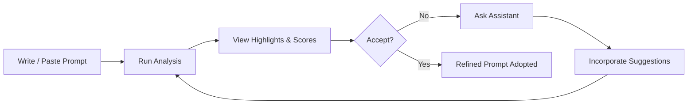

<div align="center">

# 🧭 Echo – User Experience & Interaction Flow

*From raw prompt → structured risk intelligence →### Layered Mental Model
| User Perception | Actual System Action |
|-----------------|----------------------|
| "Selecting mode…" | Mode parameter preparation (faithfulness/factuality/both) |
| "It's thinking…" | Sanitization + guideline loading |
| "Evaluating…" | AnalyzerAgent → GPT-4 with XML guidelines |
| "Scoring…" | XML parsing + PRD calculation + normalization |
| "Rendering…" | Token binding & UI materialization |

### Step 0: Analysis Mode Selection

Echo provides **three analysis modes** for different detection focuses:

#### Mode Selection UI
Users can choose their analysis focus via the toolbar selector:

```
┌──────────────────────────────────────────────────┐
│ Choose Analysis Focus:                           │
│                                                  │
│  ○ Faithfulness  - Consistency with context     │
│  ○ Factuality    - Real-world accuracy          │
│  ● Both          - Comprehensive (Default)       │
└──────────────────────────────────────────────────┘
```

#### Mode Descriptions

| Mode | Visual Indicator | When to Use | Guideline File |
|------|------------------|-------------|----------------|
| **Faithfulness** | 🟣 Purple | Check if model stays true to provided information | `faithfulness.xml` |
| **Factuality** | 🔵 Blue | Verify claims against factual/historical knowledge | `factuality.xml` |
| **Both** | 🟢 Green (Default) | Comprehensive hallucination detection | `both.xml` |

The selected mode is passed to the backend and determines which XML guidelines the AnalyzerAgent loads for risk assessment.

### Step 1: Initiation hallucination‑resistant instruction.*

</div>

---

## 1. Purpose

This document captures the **end‑to‑end experiential journey** of a user inside Echo: *authoring*, *analyzing*, *interpreting*, *refining*, and *iterating* on prompts to systematically reduce hallucination risk. It complements system internals in `architecture.md` by focusing on **behavioral flow**, **cognitive touch‑points**, and **feedback mechanics**.

## Table of Contents
- [Application Access](#application-access)
- [Main Interface Overview](#main-interface-overview)
- [Prompt Input Methods](#prompt-input-methods)
- [Analysis Process](#analysis-process)
- [Results Interpretation](#results-interpretation)
- [Prompt Refinement](#prompt-refinement)
- [Advanced Features](#advanced-features)
- [User Personas and Scenarios](#user-personas-and-scenarios)

## 2. Application Access

### 1. Initial Landing
```
User accesses: http://localhost:5174 (development)
├── Application loads with dark/light theme based on system preference
├── Main interface displays with sidebar and editor panels
└── Welcome state shows placeholder text and instructions
```

### 2. First-Time Experience Goals
| Aspect | Design Intent | Outcome |
|--------|---------------|---------|
| Cognitive Load | Minimize initial branching | User focuses on a single “Write or Paste Prompt” task |
| Trust Building | Immediate structure + neutral tone | Encourages experimentation |
| Discoverability | Subtle affordances (toolbar, chat tab) | Progressive exploration |
| Theming | Honor system preference | Reduces friction & fatigue |

## 3. Main Interface Overview

### Layout Structure
```
┌─────────────────────────────────────────────────────────────┐
│ Header: Logo, Title, Theme Toggle                           │
├───────────────┬─────────────────────────────────────────────┤
│               │                                             │
│   Sidebar     │           Main Content Area                 │
│   - Analysis  │   ┌─────────────────────────────────────┐   │
│   - Chat      │   │                                     │   │
│   - Settings  │   │        Text Editor                  │   │
│               │   │     (Prompt Input)                  │   │
│               │   │                                     │   │
│               │   └─────────────────────────────────────┘   │
│               │   ┌─────────────────────────────────────┐   │
│               │   │                                     │   │
│               │   │     Analysis Results                │   │
│               │   │   (Risk Assessment)                 │   │
│               │   │                                     │   │
│               │   └─────────────────────────────────────┘   │
└───────────────┴─────────────────────────────────────────────┘
```

### Interactive Primitives
| Element | Primary Role | Secondary Behavior |
|---------|--------------|--------------------|
| Sidebar | Mode switching (Analysis / Chat) | Future: settings / history |
| Editor Area | Prompt capture | File content ingestion |
| Toolbar | Actions (Upload / Analyze / Re-Analyze) | Analysis mode selector |
| Analysis Mode Selector | Choose detection focus | Faithfulness / Factuality / Both |
| Analysis Panels | Structured result reveal | Progressive disclosure via collapse |
| Chat Panel | Iterative refinement loop | Re-analysis trigger |
| Re-Analyze Dialog | Prompt refinement workflow | Preview generation |
| Theme Toggle | A11y / preference control | Persisted via localStorage |

## 4. Prompt Input Methods

### Method A: Direct Text Input

#### Flow:
```
1. User clicks in text editor area
2. Placeholder text disappears
3. User types or pastes prompt content
4. Real-time character count updates
5. "Analyze Prompt" button becomes active
```

#### Features:
- **Rich Text Editor**: Monospace font for readability
- **Auto-resize**: Text area expands with content
- **Syntax Highlighting**: Future enhancement placeholder
- **Character Limits**: Visual feedback for optimal prompt length

### Method B: File Upload

#### Flow:
```
1. User clicks "Upload File" button in toolbar
   OR
2. User drags file over editor area
3. File selection dialog opens (click method)
   OR
4. Drop zone activates with visual feedback (drag method)
5. File content loads into editor
6. Success message confirms upload
7. "Analyze Prompt" button becomes active
```

#### Supported File Types:
- **Text Files**: `.txt`, `.md`, `.rst`
- **Document Files**: `.doc`, `.docx` (future enhancement)
- **Code Files**: `.py`, `.js`, `.json` (future enhancement)

#### Upload Validation:
- **File Size**: Maximum 1MB limit
- **File Type**: MIME type validation
- **Content**: Text encoding verification
- **Error Handling**: Clear error messages for invalid files

## 5. Analysis Process

### Layered Mental Model
| User Perception | Actual System Action |
|-----------------|----------------------|
| “It’s thinking…” | Sanitization + prompt shaping |
| “Evaluating…” | Model call + XML / tag extraction |
| “Scoring…” | Deterministic normalization & weighting |
| “Rendering…” | Token binding & UI materialization |

### Step 1: Initiation
```
User clicks "Analyze Prompt"
├── Button state changes to "Analyzing..."
├── Progress indicator appears
├── Input controls become disabled
└── Analysis request sent to backend
```

### Step 2: Progress Indication
```
Progress Animation Sequence:
├── 0-30%: "Parsing prompt structure..."
├── 30-60%: "Evaluating risk criteria..."
├── 60-90%: "Generating assessment..."
└── 90-100%: "Finalizing results..."
```

### Step 3: Backend Processing (Agent-Based Architecture)
```
Backend Workflow (Updated):
1. Receive prompt via POST /api/analyze/ { prompt, analysis_mode }
2. Route → Sanitizer: Clean and validate input
3. Route → LLM Facade: Delegate to AnalyzerAgent
4. AnalyzerAgent Processing:
   ├── Load XML guidelines based on selected mode:
   │   • faithfulness.xml (Faithfulness mode)
   │   • factuality.xml (Factuality mode)
   │   • both.xml (Both modes - default)
   ├── Construct structured prompt with guidelines
   ├── Send request to GPT-4
   ├── Receive XML-formatted risk assessment
   ├── Parse XML structure:
   │   • Extract <CRITERION> elements
   │   • Parse <RISK_n> tagged tokens from annotated prompt
   │   • Build risk_tokens array
   ├── Calculate PRD (Prompt Risk Density):
   │   • prompt_PRD = (high_risk_tokens / total_tokens) × 100
   │   • meta_PRD = weighted average of criteria scores
   ├── Apply deterministic post-processing
   └── Format structured response
5. Return to frontend:
   {
     annotated_prompt: "...<RISK_1>text</RISK_1>...",
     risk_tokens: [{id, text, risk_level, classification, pillar}],
     risk_assessment: {
       prompt: {prompt_PRD, prompt_violations[]},
       meta: {meta_PRD, meta_violations[]}
     },
     analysis_summary: "..."
   }
```

**Key Innovation**: Agent-based delegation allows specialized analysis logic
while maintaining clean separation from conversation features.

### Step 4: Results Display
```
Results Rendering:
├── Progress bar completes (100%)
├── Analysis sections expand with animation
├── Risk assessment data populates
└── Interactive elements become available
```

## 6. Results Interpretation

### 6.1 Risk Assessment Display

#### Overall Risk Score
```
Visual Representation:
┌─────────────────────────────────────┐
│  Overall Risk Assessment            │
│                                     │
│     ◯ 65%    ← Circular Progress    │
│              ← Color-coded          │
│                (Red/Yellow/Green)   │
└─────────────────────────────────────┘
```

#### Expandable Criteria Details
```
Default State (Collapsed):
┌─────────────────────────────────────┐
│ 🔵 Hallucination Risk Score         │
│                           [Expand ▼]│
└─────────────────────────────────────┘

Expanded State:
┌─────────────────────────────────────┐
│ 🔵 Hallucination Risk Score         │
│                         [Collapse ▲]│
│                                     │
│ Risk Assessment Criteria:           │
│                                     │
│ ┌─────────────────────────────────┐ │
│ │ Ambiguous References      85%   │ │
│ │ High Risk              [🔴]     │ │
│ │ Pronouns without clear context  │ │
│ └─────────────────────────────────┘ │
│                                     │
│ ┌─────────────────────────────────┐ │
│ │ Context Completeness      60%   │ │
│ │ Medium Risk            [🟡]     │ │
│ │ Missing background information  │ │
│ └─────────────────────────────────┘ │
│                                     │
│ Overall Assessment:                 │
│ [Detailed explanation text...]      │
└─────────────────────────────────────┘
```

### 6.2 High & Medium Risk Span Visualization
```
Token Identification Display:
┌─────────────────────────────────────┐
│ 🟠 High Risk Tokens (3)             │
│                           [Expand ▼]│
│                                     │
│ "this" - Ambiguous reference        │
│ "many" - Vague quantifier          │
│ [Click expand for detailed analysis]│
└─────────────────────────────────────┘
```

### 6.3 Interaction Patterns

#### Primary Actions:
1. **Expand/Collapse Sections**: Toggle detailed views
2. **Read Risk Explanations**: Understand specific issues
3. **Identify Priority Fixes**: Focus on high-risk items
4. **Navigate to Chat**: Get refinement suggestions

#### Secondary Actions:
1. **Copy Analysis Results**: Export for external use
2. **Share Assessment**: Collaborate with team members
3. **Save Session**: Bookmark for later reference

## 7. Prompt Refinement Loop

### 7.1 Chat-Based Refinement Flow

#### Step 1: Chat Initiation
```
User Flow:
1. User clicks "Chat" in sidebar
2. Chat panel opens with prompt context
3. Pre-populated system message appears
4. User can start conversation immediately
```

#### Step 2: Interactive Dialogue
```
Chat Interface:
┌─────────────────────────────────────┐
│ 💬 Prompt Refinement Chat           │
│                                     │
│ 🤖 I can help improve your prompt   │
│    based on the risk assessment.    │
│                                     │
│ 👤 How can I fix the ambiguous      │
│    references in my prompt?         │
│                                     │
│ 🤖 Here are specific suggestions... │
│                                     │
│ ┌─────────────────────────────────┐ │
│ │ Type your message...        [📤]│ │
│ └─────────────────────────────────┘ │
└─────────────────────────────────────┘
```

#### Step 3: Suggested Improvements
```
Typical Chat Flow:
1. User asks about specific risk factors
2. Assistant provides targeted advice
3. User requests example improvements
4. Assistant shows before/after examples
5. User asks for additional refinements
6. Iterative improvement continues
```

### 7.2 Strategy Patterns by Risk Type

#### High Risk - Ambiguous References
```
User Query: "How do I fix pronouns in my prompt?"

Assistant Response:
"Replace pronouns with specific nouns:
❌ 'Analyze this data'
✅ 'Analyze the Q3 2023 sales data'

❌ 'How does it work?'
✅ 'How does machine learning work?'"
```

#### Medium Risk - Context Completeness
```
User Query: "What context should I add?"

Assistant Response:
"Add these context elements:
- Time period or date range
- Target audience or domain
- Specific constraints or requirements
- Expected output format"
```

### 7.3 Iteration Loop – Reinforcement Cycle

Canonical Mermaid source: `docs/diagrams/refinement-loop.mmd`


```
Refinement Process:
1. User receives suggestions via chat
2. User manually edits prompt in editor
3. User re-runs analysis to see improvements
4. Repeat until acceptable risk level achieved
```

### 7.4 Re-Analysis Workflow (Advanced Feature)

#### Overview

Echo provides an **advanced re-analysis feature** that leverages conversation history to intelligently refine prompts while avoiding content accumulation. This is powered by the **Preparator Service** which synthesizes insights from:
- Prior analysis findings
- Conversation-discussed improvements
- User's final manual edits

#### When to Use Re-Analysis

Echo displays a **conversation warning banner** after 5+ conversation exchanges:

```
┌─────────────────────────────────────────────────────┐
│ ⚠️ Consider Re-analyzing                             │
│                                                     │
│ You've had 7 exchanges. Re-analyzing will keep the │
│ analysis and assistant's responses most relevant   │
│ to your updated prompt.                            │
│                                                     │
│ [Re-analyze Now]  [Dismiss]                         │
└─────────────────────────────────────────────────────┘
```

#### Step-by-Step Re-Analysis Flow

##### Step 1: Trigger Re-Analysis

```
User Action Options:
1. Click "Re-Analyze" button in toolbar
2. Click "Re-analyze Now" in warning banner
3. Use keyboard shortcut (future enhancement)
```

##### Step 2: Re-Analyze Dialog Opens

```
Dialog Interface:
┌──────────────────────────────────────────────────────┐
│  🔄 Re-analyze Prompt                                 │
├──────────────────────────────────────────────────────┤
│                                                      │
│  ℹ️ Before re-analysis, you can make final changes   │
│     Add any last-minute adjustments below, then      │
│     generate a preview. This will update the         │
│     analysis and restart the conversation with       │
│     fresh context.                                   │
│                                                      │
│  📄 Current Prompt:                                  │
│  ┌────────────────────────────────────────────────┐ │
│  │ Write a blog post about AI hallucinations     │ │
│  │ and how to detect them.                       │ │
│  └────────────────────────────────────────────────┘ │
│                                                      │
│  ✏️ Additional Changes (Optional):                   │
│  ┌────────────────────────────────────────────────┐ │
│  │ Target audience: software developers          │ │
│  │ Length: 1000-1500 words                       │ │
│  │ Include code examples                         │ │
│  └────────────────────────────────────────────────┘ │
│                                                      │
│  [✨ Generate Preview]                               │
│                                                      │
│  [Cancel]                                            │
└──────────────────────────────────────────────────────┘
```

##### Step 3: Generate Preview

```
User clicks "Generate Preview"
│
├── Loading Animation: "Generating preview..."
│
├── Frontend sends POST /api/prepare/prepare with:
│   ├── current_prompt (base text)
│   ├── prior_analysis (violations, risk tokens, PRD scores)
│   ├── conversation_history (for semantic context)
│   └── user_final_edits (optional manual additions)
│
├── Backend Preparator Service:
│   ├── Loads hallucination mitigation guidelines
│   ├── Understands conversation context (what was discussed)
│   ├── Identifies improvements suggested in chat
│   ├── Applies mitigation strategies to fix identified risks
│   ├── Integrates user's final edits
│   ├── **Critically**: Does NOT copy conversation text
│   └── Generates refined prompt
│
└── Preview appears in dialog
```

```
Preview Display:
┌──────────────────────────────────────────────────────┐
│  ✨ Preview of Refined Prompt:                        │
│  ┌────────────────────────────────────────────────┐  │
│  │ ✨ This refined prompt incorporates insights   │  │
│  │    from your conversation, the hallucination   │  │
│  │    mitigation guidelines, and the prior        │  │
│  │    analysis to provide guided improvements.    │  │
│  └────────────────────────────────────────────────┘  │
│                                                      │
│  ┌────────────────────────────────────────────────┐  │
│  │ Write a blog post about AI hallucinations     │  │
│  │ and how to detect them.                       │  │
│  │                                               │  │
│  │ Target audience: software developers with     │  │
│  │ intermediate knowledge of machine learning.   │  │
│  │                                               │  │
│  │ Length: 1000-1500 words                       │  │
│  │                                               │  │
│  │ Include specific code examples showing:       │  │
│  │ - Prompt engineering techniques               │  │
│  │ - Detection methods                           │  │
│  │ - Mitigation strategies                       │  │
│  │                                               │  │
│  │ Format: Technical blog post with clear        │  │
│  │ sections and practical takeaways.             │  │
│  └────────────────────────────────────────────────┘  │
│                                                      │
│  [Cancel]  [🔄 Confirm & Re-analyze]                 │
└──────────────────────────────────────────────────────┘
```

##### Step 4: Confirm & Re-analyze

```
User clicks "Confirm & Re-analyze"
│
├── Dialog closes with loading animation
│
├── System updates:
│   ├── Refined prompt replaces editor content
│   ├── Conversation history is cleared (fresh start)
│   ├── Show conversation warning dismissed
│   └── Re-analysis dialog closed
│
├── Automatic analysis triggered:
│   ├── Same flow as initial analysis (Step 1-4)
│   ├── Using currently selected analysis mode
│   └── With refined prompt as input
│
└── Fresh results display:
    ├── New PRD scores calculated
    ├── New risk tokens identified
    ├── Updated risk assessment
    └── Clean conversation state (no accumulated context)
```

#### Key Benefits of Re-Analysis

| Benefit | Explanation |
|---------|-------------|
| **Context-Aware** | Uses conversation to understand improvements needed |
| **No Content Bloat** | Doesn't copy conversation text into prompt |
| **Preview First** | See changes before committing to re-analysis |
| **Fresh Start** | New analysis with clean conversation state |
| **Intelligent Synthesis** | Applies mitigation strategies discussed in chat |
| **Iterative Improvement** | Supports multiple refinement cycles |

#### Technical Details

The re-analysis workflow is powered by three backend components:

```
Frontend            Backend Services
────────           ────────────────────────
                   
Re-Analyze Dialog  →  POST /api/prepare/prepare
                      ├── Preparator Service
                      │   ├── Load guidelines
                      │   ├── Parse conversation context
                      │   ├── Apply mitigation strategies
                      │   └── Generate refined prompt
                      └── Return: { refined_prompt, success }
                   
[Confirm]          →  POST /api/analyze/
                      ├── AnalyzerAgent
                      │   ├── Load mode-specific guidelines
                      │   ├── Analyze refined prompt
                      │   ├── Calculate PRD scores
                      │   └── Extract risk tokens
                      └── Return: Full analysis results
```

For technical implementation details, see:
- `docs/architecture.md` - Agent architecture
- `docs/RE-ANALYSIS_FIX.md` - Content accumulation prevention

## 8. Advanced Features

### 8.1 Theme Customization

#### Theme Toggle Flow:
```
1. User clicks theme toggle button (🌙/☀️)
2. Theme preference toggles immediately
3. Visual transition animates smoothly
4. Preference saved to localStorage
5. Future sessions remember choice
```

#### Theme Variations:
- **Light Mode**: High contrast, professional appearance
- **Dark Mode**: Reduced eye strain, modern aesthetic
- **System**: Follows OS preference automatically

### 8.2 Keyboard Shortcuts

#### Text Editor:
- `Ctrl+A`: Select all text
- `Ctrl+C/V`: Copy/paste functionality
- `Ctrl+Z`: Undo text changes
- `Tab`: Insert indentation

#### Application:
- `Ctrl+Enter`: Trigger analysis
- `Esc`: Close modals/dialogs
- `F1`: Open help documentation

### 8.3 Responsive Design

#### Desktop (>1024px):
- Full sidebar visible
- Side-by-side editor and results
- Maximum content density

#### Tablet (768-1024px):
- Collapsible sidebar
- Stacked editor and results
- Touch-optimized controls

#### Mobile (<768px):
- Hidden sidebar (hamburger menu)
- Single-column layout
- Simplified interface elements

## 9. User Personas & Scenarios

### Persona 1: Academic Researcher

#### Background:
- Dr. Sarah Chen, AI researcher
- Needs to verify prompt accuracy for research papers
- Values detailed analysis and documentation

#### Typical Flow:
```
1. Uploads research prompt from file
2. Reviews detailed risk assessment
3. Uses chat to understand specific concerns
4. Iteratively refines for academic standards
5. Documents final prompt in research notes
```

#### Key Features Used:
- File upload functionality
- Detailed criteria explanations
- Export capabilities
- Chat-based refinement

### Persona 2: Content Creator

#### Background:
- Mike Rodriguez, technical writer
- Creates AI-generated content for blogs
- Needs quick, actionable feedback

#### Typical Flow:
```
1. Types prompt directly in editor
2. Quickly scans overall risk score
3. Focuses on high-risk items only
4. Makes rapid adjustments
5. Re-analyzes for confirmation
```

#### Key Features Used:
- Direct text input
- Visual risk indicators
- Quick analysis turnaround
- Mobile-responsive design

### Persona 3: Business Analyst

#### Background
*Jennifer Park – domain analyst needing reliable model outputs for reporting.*

#### Motivations
| Need | System Support |
|------|----------------|
| Avoid misleading summaries | Clear high‑risk span marking |
| Rapid iteration | Fast re‑analysis loop |
| Justification for edits | Criteria explanations |

#### Typical Flow
1. Pastes unstructured draft request.
2. Identifies vague “business impact” phrases flagged red.
3. Uses chat to convert them into measurable KPIs.
4. Re‑analyzes → risk drops from 65% → 35%.
5. Exports final prompt to documentation space.

---

## 10. Cognitive Design Considerations

| UX Challenge | Mitigation | Result |
|--------------|-----------|--------|
| Invisible model heuristics | Explicit span tags + criteria names | Builds trust |
| Overwhelm on first result | Collapsible panels | Progressive assimilation |
| Unclear next action | Highlighted high‑risk tokens first | Action prioritization |
| Ambiguous improvement path | Assistant gives before/after examples | Teaches pattern |

---

## 11. Future UX Extensions

| Idea | Benefit |
|------|---------|
| History timeline | Track quality evolution / deltas |
| Multi‑prompt batch mode | Benchmark alternatives rapidly |
| Inline editing within highlights | Reduce context switching |
| Risk criterion tuning | Adapt system to domain vocabulary |
| Export to PDF / Markdown | Thesis / audit readiness |

---

## 12. Summary

Echo’s user flow intentionally mirrors a **scientific refinement loop**: *observe → hypothesize → apply → re‑measure*. By surfacing **why** each span is risky and providing a low‑friction path to improvement, the system shortens the cognitive distance between **problem detection** and **prompt mastery**.

> *“Clarity is not decorative; it is defensive.”*

See: `architecture.md` for the underlying technical mechanics.

- Needs reliable, fact-based outputs

#### Typical Flow:
```
1. Pastes business query from spreadsheet
2. Reviews risk assessment thoroughly
3. Engages extensively with chat for refinement
4. Tests multiple prompt variations
5. Shares results with team members
```

#### Key Features Used:
- Copy/paste functionality
- Comprehensive risk analysis
- Interactive chat guidance
- Collaborative features

### Persona 4: Developer

#### Background:
- Alex Thompson, software engineer
- Integrates AI into applications
- Needs programmatic prompt validation

#### Typical Flow:
```
1. Tests various prompt templates
2. Analyzes API response patterns
3. Documents best practices
4. Automates prompt validation workflow
5. Shares findings with development team
```

#### Key Features Used:
- Multiple prompt testing
- Technical documentation
- API response analysis
- Development workflow integration

## Error Handling and Edge Cases

### Network Connectivity Issues
```
Scenario: User loses internet connection during analysis
Response: 
- Show friendly error message
- Provide retry functionality
- Preserve user's prompt content
- Suggest offline alternatives
```

### Invalid Input Handling
```
Scenario: User uploads non-text file
Response:
- Display clear error message
- Suggest supported file formats
- Provide format conversion guidance
- Maintain user's previous content
```

### API Rate Limiting
```
Scenario: OpenAI API quota exceeded
Response:
- Show informative error message
- Suggest trying again later
- Provide alternative approaches
- Cache previous results when possible
```

### Large Prompt Handling
```
Scenario: User inputs extremely long prompt
Response:
- Show character/token count warnings
- Suggest optimization strategies
- Offer prompt summarization
- Implement graceful truncation
```

## Performance Optimization

### Loading States
- **Initial Load**: Progressive content loading
- **Analysis**: Real-time progress indicators
- **Results**: Smooth animations and transitions
- **Chat**: Streaming response display

### Caching Strategy
- **Results**: Cache analysis results locally
- **Preferences**: Store user settings
- **Chat History**: Maintain session context
- **File Uploads**: Temporary storage for re-analysis

### Mobile Optimization
- **Touch Targets**: Minimum 44px touch areas
- **Scroll Performance**: Optimized scrolling behavior
- **Battery Usage**: Efficient rendering and minimal re-renders
- **Data Usage**: Compressed API responses

## Accessibility Features

### Screen Reader Support
- **Semantic HTML**: Proper heading hierarchy
- **ARIA Labels**: Descriptive labels for interactive elements
- **Focus Management**: Logical tab order
- **Alternative Text**: Meaningful descriptions for visual elements

### Keyboard Navigation
- **Tab Navigation**: Full keyboard accessibility
- **Focus Indicators**: Clear visual focus states
- **Keyboard Shortcuts**: Efficient power-user features
- **Skip Links**: Quick navigation to main content

### Visual Accessibility
- **High Contrast**: WCAG compliant color ratios
- **Font Scaling**: Responsive text sizing
- **Color Independence**: Information not solely conveyed by color
- **Motion Reduction**: Respect user's motion preferences

This comprehensive user flow documentation ensures that all user interactions with Echo Hallucination Detection are well-understood, from initial access through advanced feature usage and edge case handling.
